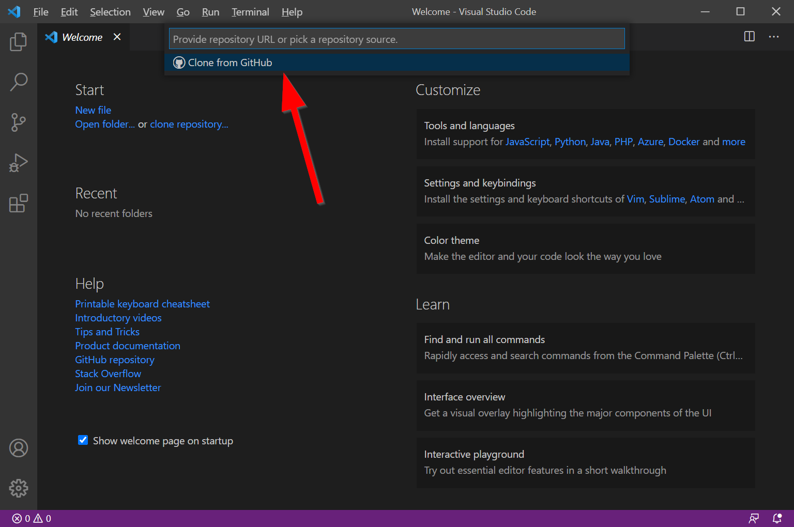
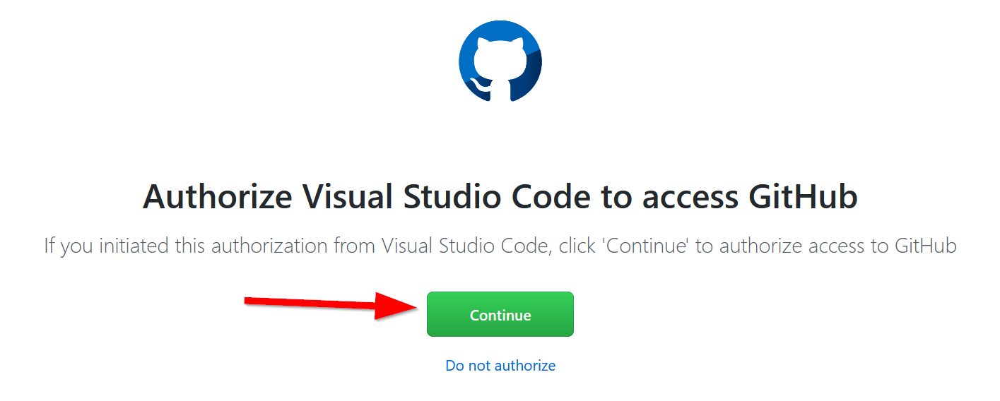
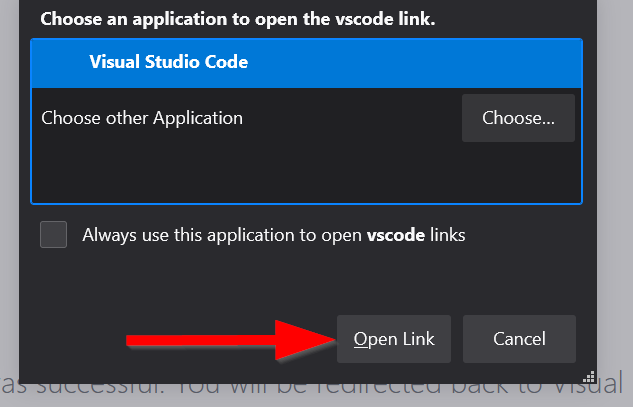
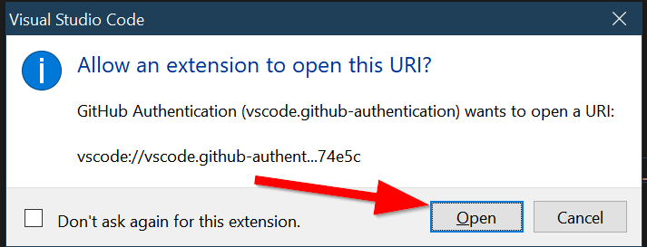
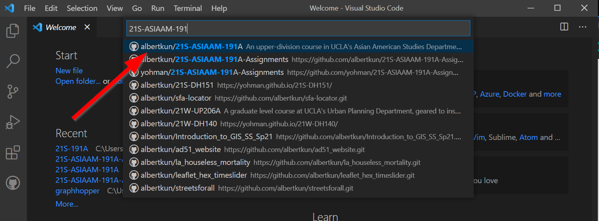
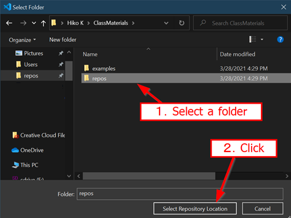
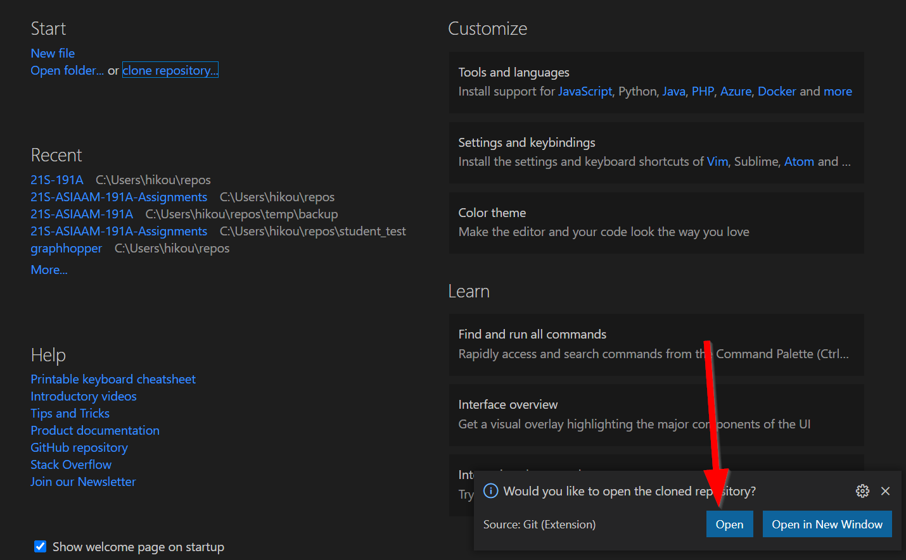

# Guide for cloning

1.  Launch VS Code from Launcher (Mac) or Start Menu (PC)

2.  On the `Welcome` screen click `Clone Repository`:

{: style="max-width:700px"}

1.  Click `Clone from GitHub`

{: style="max-width:700px"}

4.  Allow GitHub to sign in Accept the following dialogue box:

{: style="max-width:500px"}

1.  Click `Continue` in the web browser that opens up:

{: style="max-width:500px"}

6.  Click `Choose Application`

{: style="max-width:500px"}

7.  Click Open Link:

{: style="max-width:500px"}

8.  Click `Open`:

{: style="max-width:500px"}

9.  Search for the class repository by typing `21S-191A-AsianAm` and
    then select the repository: **albertkun/21S-ASIAAM-191A**

{: style="max-width:700px"}

10. Select a folder to clone into:

{: style="max-width:700px"}

11. Click `Open` in your locally cloned repo:

{: style="max-width:700px"}

12. You can see the files by clicking on the Explorer to the right:

{: style="max-width:700px"}

13. Now you are ready for all labs!
