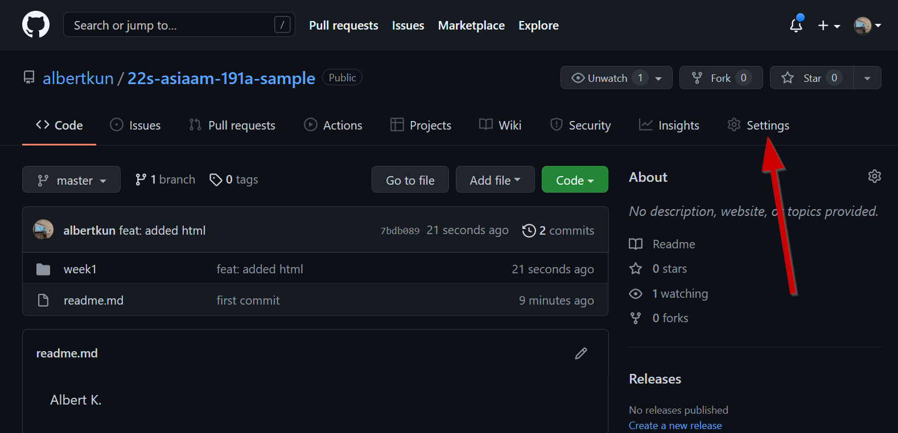
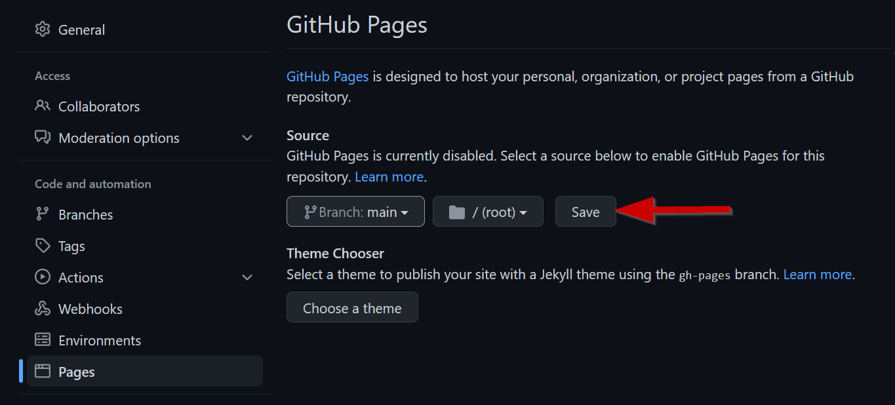

# Let's Git to Committing!

**Commits** are the basis of `Git` and `GitHub`.

In a nutshell, **Committing** is `Git` speak for **saving files**. However, these saves come with a note so that you can refer back to save later! 

It's better than autosaving because you have a description of what that save is! 

Let's make our first commit:

Click on the `Source Control` icon in the activity bar in VS Code:

{: style="max-width:300px"}

Enter a note for your commit:
{: style="max-width:300px"}

Click the `checkmark` OR use the following shortcut:

 - **PC:** ++ctrl+enter++

 - **MAC:** ++cmd+enter++

{: style="max-width:300px"}

Next, click on the `...` for expanding the menu items:

{: style="max-width:300px"}

Finally, click on `Push` to upload your changes to GitHub:

{: style="max-width:300px"}

## Using GitHub Pages

After you have saved and committed your files to GitHub visit your repository on https://www.github.com.

Click on ==Settings==:

{: style="max-width:300px"}

Click on ==Pages==:

{: style="max-width:300px"}

and under **Source** , click on the ==main== branch:

{: style="max-width:300px"}

Choose ==root==:

{: style="max-width:300px"}

Click on ==Save==:

{: style="max-width:300px"}

Copy this link:

{: style="max-width:300px"}

!!! warning "Nothing shows up?!😱"

    If you navigate to `https://YOUR_GITHUB_ACCOUNT.github.io/22s-asiaam-191a-assignments/` it will be blank because there's nothing in the `root`.

    You have to add `/YOUR_WEEK_1_FOLDER_NAME/index.html` to access the contents of the lab!

    For example, `https://albertkun.github.io/22s-asiaam-191a-assignments/week1/index.html`

Post it in the Discussion forum for the appropriate lab:

{: style="max-width:300px"}

Paste your link in the comment box at the bottom

{: style="max-width:300px"}

Click on ==Comment== to submit the lab:

{: style="max-width:300px"}

