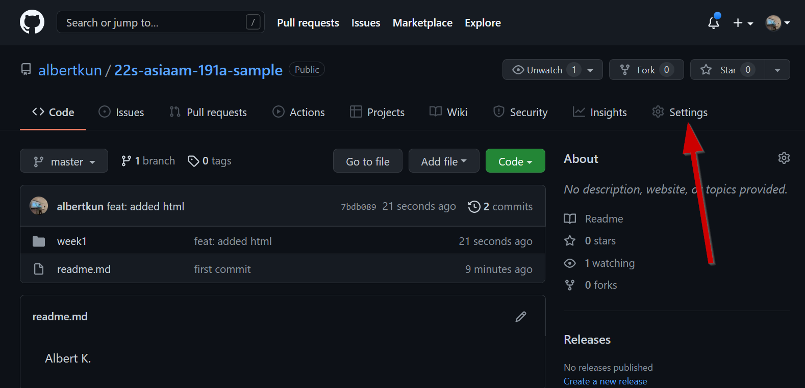
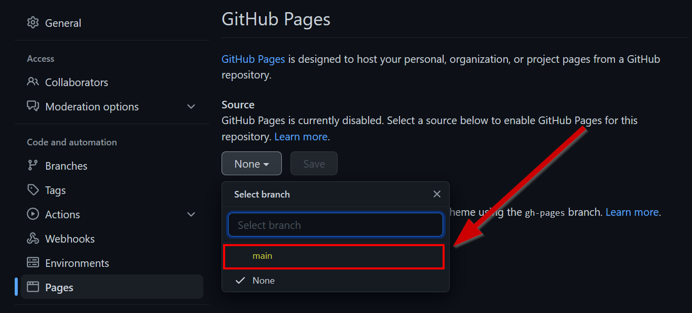

# Let's Git to Committing!

**Commits** are the basis of `Git` and `GitHub`.

In a nutshell, **Committing** is `Git` speak for **saving files**. However, these saves come with a note so that you can refer back to save later! 

It's better than autosaving because you have a description of what that save is! 

Let's make our first commit:

Click on the `Source Control` icon in the activity bar in VS Code:

{: style="max-width:300px"}

Enter a note for your commit:
{: style="max-width:300px"}

Click the `checkmark` OR use the following shortcut:

 - **PC:** ++ctrl+enter++

 - **MAC:** ++cmd+enter++

{: style="max-width:300px"}

Next, click on the `...` for expanding the menu items:

{: style="max-width:300px"}

Finally, click on `Push` to upload your changes to GitHub:

{: style="max-width:300px"}

## Using GitHub Pages

After you have saved and committed your files to GitHub visit your repository on https://www.github.com.

Click on ==Settings==:

{: style="max-width:300px"}

Click on ==Pages==:
{: style="max-width:300px"}

and under **Source** , click on the ==main== branch:
{: style="max-width:300px"}

Choose "root":
{: style="max-width:300px"}

Click on Save:
{: style="max-width:300px"}

Copy the link and put it in your `readme.md` file in the `week1` folder.
{: style="max-width:300px"}

If you named your repository `22s-asiaam-191a-assignments` then you can see the `html` file if you go to:

- `https://YOUR_GITHUB_ACCOUNT.github.io/22s-asiaam-191a-assignments/week1/index.html`
