# Lab 1: GITting Used to Web Development and JavaScript

!!! warning
    The [pre-lab](../../assignments/week1/prelab) must completed before attempting this lab.

> ### Objectives:
 > - Create a basic webpage 
 >- Add a Leaflet map
 >- Add GeoJSON data to the map
 >- Create a GeoJSON online

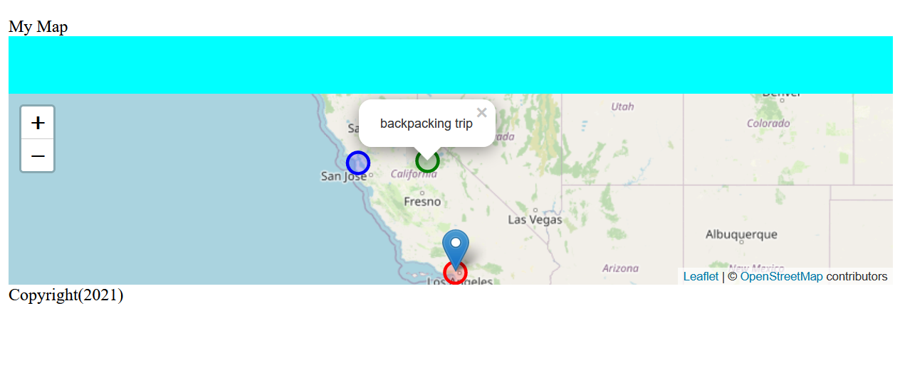
This lab will walk you through the process of creating a static web page in HTML with some additional style elements using CSS. Then you will be tasked to add a map using the [Leaflet JS library](https://www.leafletjs.com/) and host it using GitHub pages.

>Note: I highly recommend checking out the [Leaflet  documentation](https://leafletjs.com/reference-1.7.1.html). Looking at any documentation before choosing any software is important, because badly documented libraries can make tools difficult to use. 


## Let's get VS Coding!

Go to https://www.gitHub.com  and make sure you are logged in.

Create a new repository by clicking on the `+` button next to your profile picture:

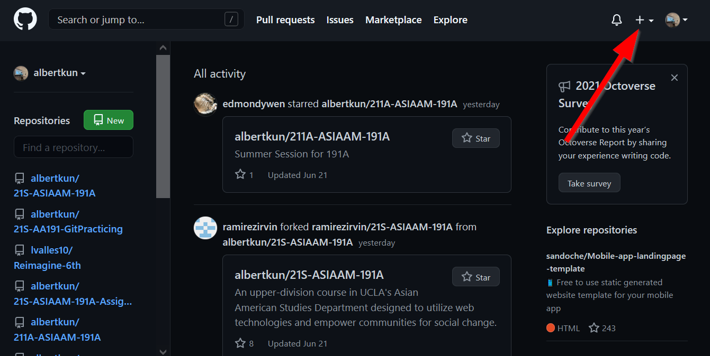

Click `New repository`:

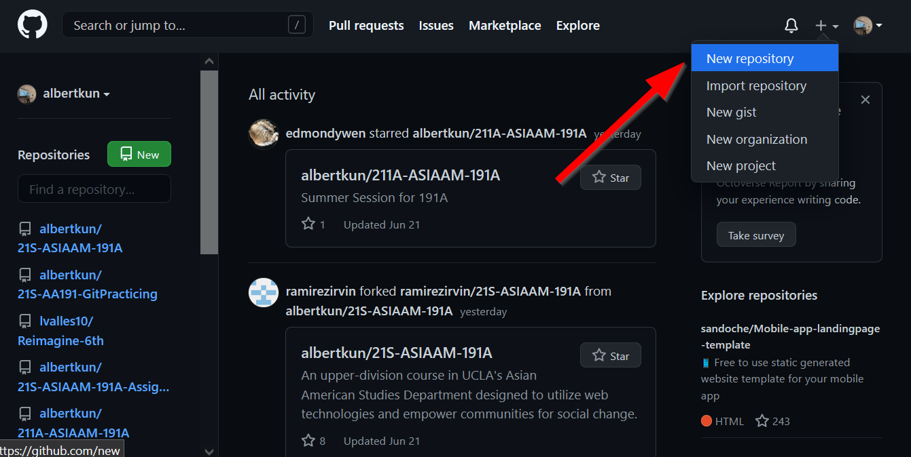

Give it a name that indicates these will be the  assignments for the class:

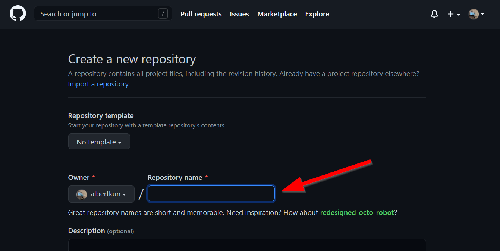

For example `211S-191A-Assignments`:

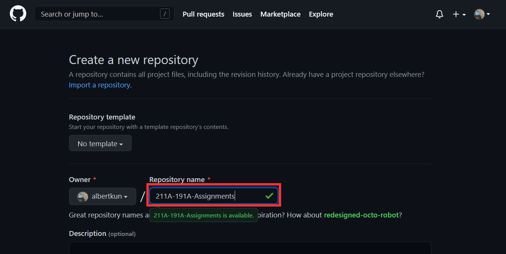

Scroll down to `Create Repository`:

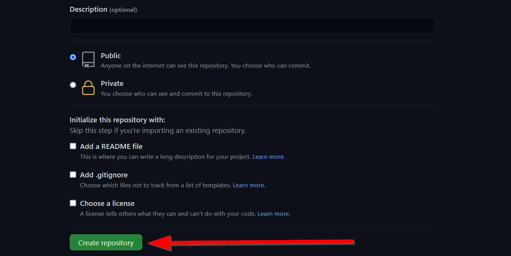

Click the `clipboard` button:

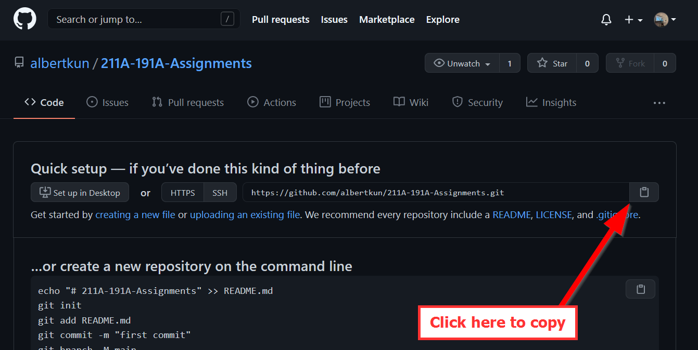

In `VS Code` make click on: `Clone Git Repository`


Paste your copied link in the panel above:

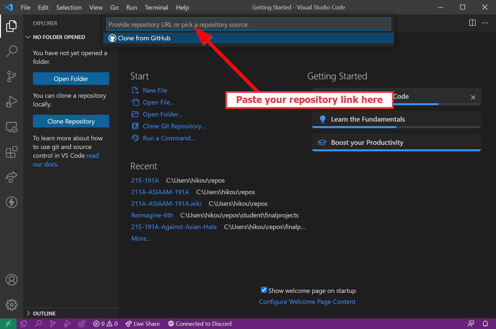

Click on `Clone from URL`:

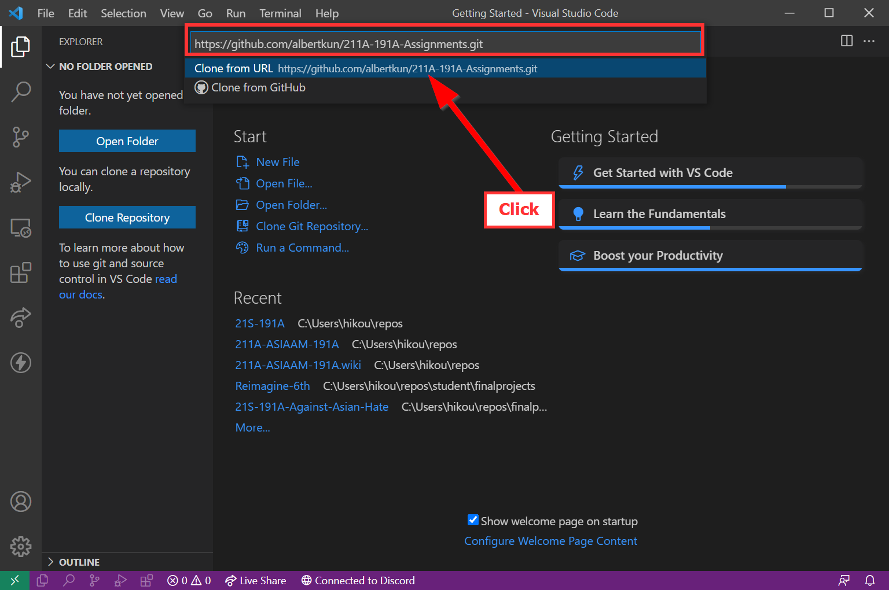

Choose a folder to save your files locally to:


Click on `Open` this new repository:


Make sure Explorer is open in the `Activity Bar` by clicking on it:


Click the `Folder` icon to make a new folder:


Title it `week1`:

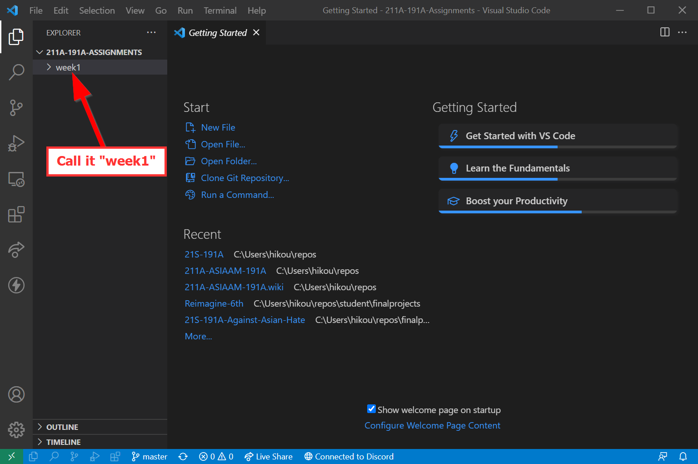

With the folder selected, click the `New file` icon and give it the title `index.html`:


Make sure `index.html` is within `week1`:
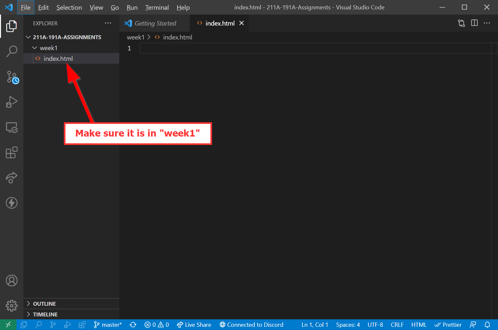

## HTML?! Oh what `tag`gony!

HTML is what makes up the house for websites to be able to  talk to the server. Everything in HTML is surrounded by tags which look like this:
`<tag> Look Ma'! I'm in a tag! </tag>`

### Attributes in tags
If we can only use tags, the web would be a pretty boring place. So in order to make each tag unique, we can add attributes to them. To do so, you add an `attribute="some value"`

For example, we can name a tag something:
`<tag name="Albert"></tag>`

Wow, that's my name tag!

### Boilerplate vs. Template Code
In coding, boilerplate code is ready to use code that people can freely copy and use with no changes. Think of them as ready-to-eat microwave dinners.
```html
<!DOCTYPE html>
<html lang="en">
<head>
  <meta charset="UTF-8"/>
  <title></title>
</head>
<body>

</body>
</html>
```

Template code refers to sample code that can be copied and pasted, but requires modifications in order for it to work.

Here is our template code:

```html
<!DOCTYPE html>
<html>
    <head>
        <title>Hello World with Leaflet</title>
        <meta charset="utf-8" />
        <link rel="shortcut icon" href="#">

        <!-- I'd add some style if here if I had any -->

    </head>
    
    <body>
        <header>
            Hello World!
        </header>
        
        <div class="main">
        <!-- hint: majority of your lab assignment can go here     -->
        
        </div>


        <div id="footer">
Copyright(2021)
        </div>
        
    </body>
</html>
```

> What do you observe in the code? 
> 1. How does this code differ from the boilerplate code?
> 2. Why should everything be enclosed in the `html` tag?
> 3. Do empty spaces matter in HTML?
> 4. What is a comment and how do you write one?
> 5. Is there a difference between the `class` and `id` attributes?

### In-Class Exercise #1
Let's fix our code so that it actually looks presentable. Look for the errors in the template code.

Save the file and name it `index.html` and open it in Firefox.

### Preview our file
Install the Live Server extension:
[https://marketplace.visualstudio.com/items?itemName=ritwickdey.LiveServer](https://marketplace.visualstudio.com/items?itemName=ritwickdey.LiveServer)

Click on Go Live!


Your default browser should automatically pop-up, if it is not Firefox, you will need to copy and paste the link over.


Note: If you do not want to use live server then you will need to right click on your `index.html` file and `reveal in file explorer`. Then, double click on the file. There are lots of limitations checking your HTML this way though.


## Cool Stylin' Sheets
Let's add some Cascading Style Sheets (CSS) to visualize our page better.

Insert the following code in the `<head>` right before the closing tag (i.e. `</head>`):

```html
<style>
    html {
        background-color: azure;
    }
</style>
```
What happened to the page?

That's cool! But this way of using CSS, called inline CSS, can make your HTML file long and cumbersome. So it's usually better to have a separate file for CSS and bring that whole file in as a linked source.

### Adding linked CSS
Click the new folder button:


Type in `styles` to name the folder `styles`:


Highlight the `styles` folder by clicking on it:


Then click on the `new file` button file:

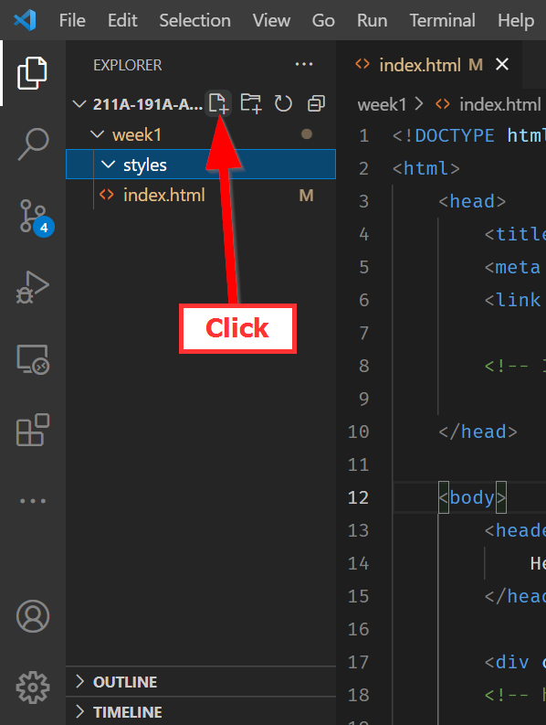

Name the file `style.css`:


Double click to open the new file. Then copy and paste the following CSS:

> styles/style.css
```
html, body {
    padding: 5px;
 }

 body {
     display: grid;
     grid-template-rows: .1fr .30fr .60fr .05fr;
     grid-template-columns: 1fr;
     grid-template-areas: "header" "main" "map"  "footer";
     justify-content: center;
 }

 header {
    grid-area: header;
    display: grid;
    grid-template-columns: .2fr .6fr .2fr;
    justify-content: center;
 }

.main {
    display: grid;
    grid-area: main;
    background-color: aqua;
}

#map {
    grid-area: map;
    height: 40vh;
}

#footer {
    grid-area: footer;
}
```
Remember to save the `style.css` file!

Next, go back to the `index.html` file and replace your entire `<style> </style>` content and tags with this code:
```
<link rel="stylesheet" href="styles/style.css">
```

This code tells the HTML file to use all of the CSS styles linked in the `href` attribute.

#### Note: You can have as many external references as you'd like, as long as you link them in this way, but the bottom most CSS file has priority!

We will go into CSS in more detail later, but what you need to know is that CSS has `HTML element selectors` which are then followed by the styles in `{ }`.

## JavaScript
JavaScript makes sure our page knows how to function and react. There are different frameworks for JavaScript, like React.js and vue.js, but this class will be focusing on vanilla JavaScript with ES7+ standards. All JavaScript must be contained within a script tag. In our `<head>` tag, let's add a `<script></script>` tag.

Sometimes it also becomes important to put JavaScript in the footer tag, why is that? Sometimes you need JavaScript functions to run after the body loads, so putting `<script>` after the `</body>` becomes necessary. This will be relevant when we bring in `Leaflet.js` because `Leaflet` should go in the header, while our `Javascript` comes after, preferrably in the footer.

### Let's a-(variable)-go!
Variables are like "boxes" that hold information. They can be "numbers", "text", or even collections of variables! In programming languages we call those "types" of variables. With JavaScript, variables are automatically assigned types based on their declaration. We'll discuss more next week, but what you need to know for now is how to `declare` variables.

This is an example of a declaration:
```js
var day = 8;
var name = "Albert";
```
In front you see the `var` keyword that tells the web browser, "Hey this is a variable!". In this example, `day` is a **numeric** type with a value of `8` and `name` is a **string** type. Each type has certain properties and uses, for example you can add **numbers** together using something like `day + day`, but you adding strings will simply concatenate and not total them.

With JavaScript ES7, we no longer use the `var` keyword, but instead `let` and `const` keywords to declare variables. They get declared in the same way:

```js
let day = 8;
const name = "Albert";
```

### Let vs Const vs Var
What is the difference? 

1. `let` declaration allows a variable to change
2.  `const` means a variable is constant and will never change.
3. `var` can be both changed and never changed depending on where it was declared! VERY PROBLEMATIC!

Because `var` can be changing (mutable) and unchanging at the same time, so it was broken off into two variable types, `let` and `const`. 

So, bye bye `var` and `LET` us welcome our new `CONST` variables to the programming world.

To recap: DO NOT USE `var` unless you need to code for old browsers.

### Console.log()
By itself, our script tag does nothing. So, one VERY important JavaScript method that we should familarize ourself with is `console.log()`, because it allows us to test our code without things showing up in the webpage.

Add the following script:
```html
<script>
    console.log('Hello Asian Am 191! :)');
</script>
```

#### Nothing happened?! What!?
Actually, you are about to unlock your full web developer potential! 

In Firefox, right click anywhere on the page and the click `Inspect Element`:
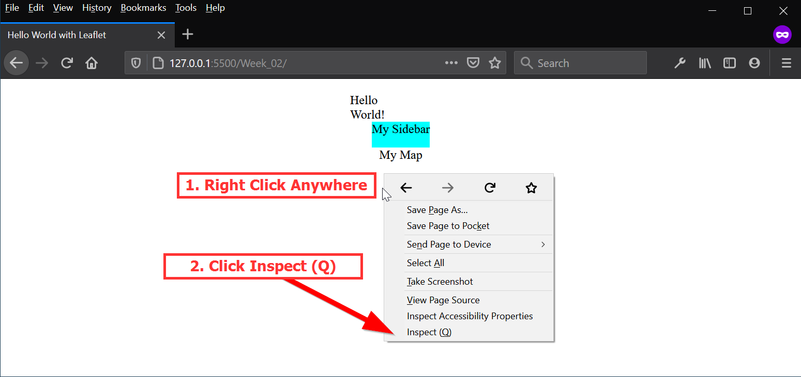
This opens the `Developer Toolbar`!! You can find it by going to the Menu and going to `Web Developer` and then `Web Developer Tools`.

Click on the Console button:

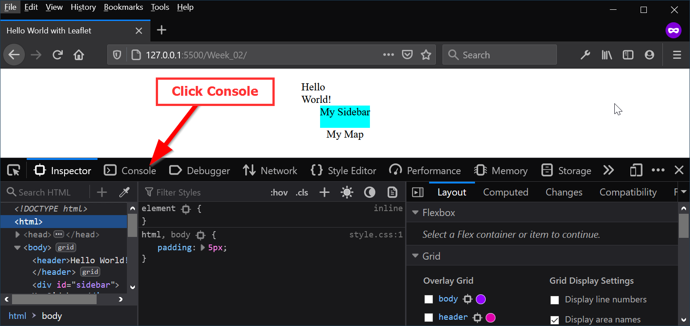

Yay! Our message is there!


### Linking to another JavaScript file
Similar to the CSS files, we can move the JavaScript file into its own folder to avoid cluttering the HTML file. Importing libraries is the main way we level up our webpage.

BUT!!! Instead of `<link>` we use the `<script>` tag:

```html
 <script src="YOUR_SCRIPT_NAME.js"></script> 
```

The `src` attribute is location of your file.

### In-class Exercise #2
>#### Task:
>- Create a new folder called `js`
>- Add our script in there
>- Get our message to show up in the console 


<details>
<summary><b>Answer</b></summary>

1. Click on the `New Folder` button:


2. Type in `js`:


3. Click on the `New File` button:


4. Give it a name, like `init.js`


5. Within `index.html` before the end of the `<body>` element include the following:

```js
    //
    // ... HTML Truncated for brevity ...
    // 
    <script src="./js/init.js"></script>
</body>
```

</details>

### Hint
Never include `<script></script>` tags inside of a Javascript file, those are `HTML elements`!!!

## Hello Leaflet... Finally..
OK, why did we do ALL of that? Well, when we use Leaflet, we actually need to bring in Leaflet's external CSS and JavaScript files!

So, in our header, let's add the following:
```html
<!-- Leaflet's css-->
<link rel="stylesheet" href="https://unpkg.com/leaflet@1.7.1/dist/leaflet.css" />

<!-- Leaflet's JavaScript-->
<script src="https://unpkg.com/leaflet@1.7.1/dist/leaflet.js"></script>
```

Now, let's go ahead and add a container for our map. 

After `<div id="main"></div>` add a new `<div></div>` tag, and give it an ID attribute of "map":

```html
<div id="map"></div>
```

With our container ready to go, open up the JavaScript file again and add the following Leaflet code template:

```javascript

// JavaScript const variable declaration
const map = L.map('map').setView([34.0709, -118.444], 15);

// Leaflet tile layer, i.e. the base map
L.tileLayer('https://{s}.tile.openstreetmap.org/{z}/{x}/{y}.png', {
	attribution: '&copy; <a href="https://www.openstreetmap.org/copyright">OpenStreetMap</a> contributors'
}).addTo(map);

//JavaScript let variable declaration to create a marker
let marker = L.marker([34.0709, -118.444]).addTo(map)
		.bindPopup('Math Sciences 4328 aka the Technology Sandbox<br> is the lab where I work in ')
		.openPopup();

```
#### Class Exercise #3 - Adding more markers
- Looking at the code above a little bit, we can see some latitude/longitude pairs. Copy the marker code add more markers of your choosing. **Note**: Be sure give the marker variable a new name, like `marker2`.  
- To find latitude/longitude of coordinates, please use this website:
   - [https://www.latlong.net/](https://www.latlong.net/)

- Optional: Not happy with the basemap?
See if you can switch the basemap out by visiting here and the changing `L.tileLayer`: 
   - [https://leaflet-extras.github.io/leaflet-providers/preview/](https://leaflet-extras.github.io/leaflet-providers/preview/)

## Let's Git to Committing!
`Commits` are the basis of `Git` and `GitHub`.

In a nutshell, `Committing` is `Git` speak for **saving files**. However, these saves come with a note so that you can refer back to save later! 

It's better than autosaving because you have a description of what that save is! 

Let's make our first commit:

Click on the `Source Control` icon in the activity bar in VS Code:


Enter a note for your commit:


Click the `checkmark` OR use the following shortcut:
 - PC: `Ctrl + Enter`
 - MAC: `Cmd + Enter`


Next, click on the `...` for expanding the menu items:


Finally, click on `push` to upload your changes to GitHub:


## Using GitHub Pages
After you have saved and committed your files to GitHub visit your repository on https://www.gitHub.com.

Click on Settings:
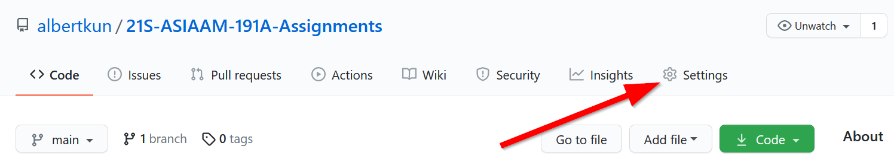


Scroll down to "GitHub pages" and under source click here: 
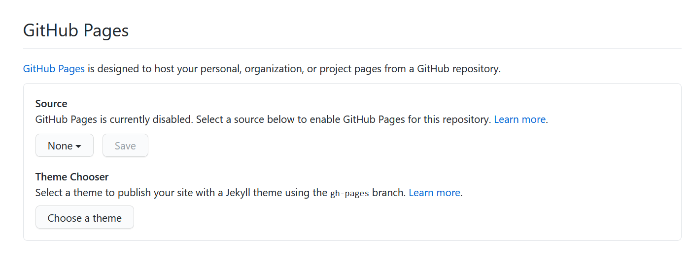

Click on the "main" branch:


Choose "root":


Click on Save:
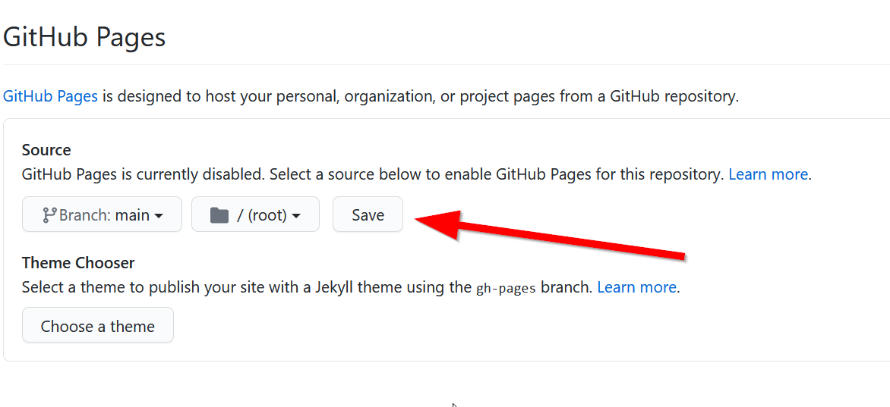


Copy the link and put it in your `readme.md` file in the `week 1` folder.
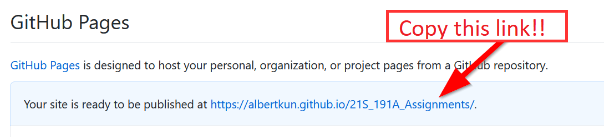

You can see the `html` file if you go to 
`https://YOUR_GITHUB_ACCOUNT.github.io/21S-ASIAAM-191A-Assignments/week1/index.html`

## Adding a GeoJSON file

### The power of web mapping

Let's put to practice what web development and GIS can do for empowering our own stories.

Head over to this website:
[http://www.geojson.io/](http://www.geojson.io/)

Click on the marker tool:


Click on a location of interest to you:


Add a data column:


Call it **`place`** and click "OK":


Click inside the **`place`** column

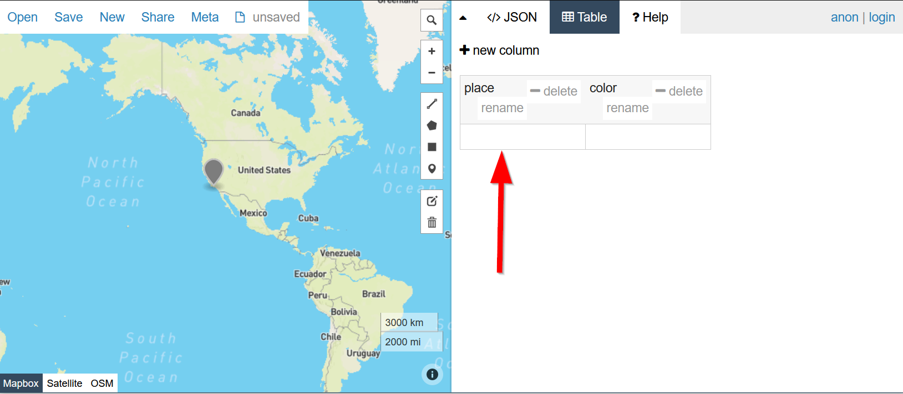

Type in a description for the place, in this case I called it `home`.


Zoom out:
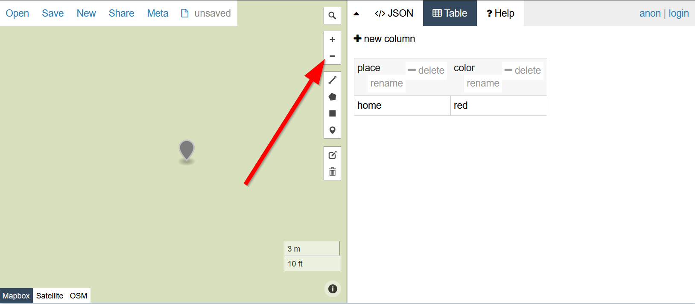

Click the edit button:


Click the move the marker to the adjust the location:


Save your edit:


Repeat these steps until you have a few more points.

Add another column called "color", to put some color to your map later.


Save your file:

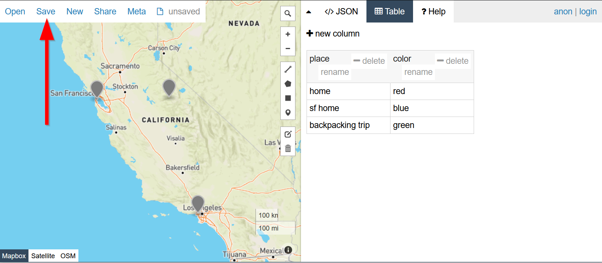

Click geoJSON:


Download the file to your computer:


Copy the file into your project folder:


### FETCH and THEN
We will use the JavaScript [Fetch API](https://developer.mozilla.org/en-US/docs/Web/API/Fetch_API/Using_Fetch) to get our geojson file and then add it to our map. In JavaScript whenever you see a `.` after a parenthesis, it means you are **chaining** a command to follow it. In this case we are chaining a `then` method. 


```javascript
fetch("map.geojson")
    .then(response => {
        return response.json();
    })
    .then(data =>{
        // Basic Leaflet method to add GeoJSON data
        L.geoJSON(data).addTo(map)
    });
```
The map should now have a blue tint over it and you cannot interact with it. Not really useful.

### Clickable GeoJSON
This is the basic Leaflet method for a clickable geojson:
```javascript
// the leaflet method for adding a geojson that is red in color:
L.geoJSON(geojsondata, {
    style: function (feature) {
        return {color: 'red'};
    }
}).bindPopup(function (layer) {
    return layer.feature.properties.name;
}).addTo(map);
```

We are going to put that code right into our `L.geoJSON(data)` line, but we will replace `geojsondata` with `data` that is being chained from our `then` method:

```javascript
fetch("map.geojson")
	.then(response => {
		return response.json();
		})
    .then(data =>{
        // Basic Leaflet method to add GeoJSON data
                        // the leaflet method for adding a geojson
            L.geoJSON(data, {
                style: function (feature) {
                    return {color: layer.feature.properties.color};
                }
            }).bindPopup(function (layer) {
                return layer.feature.properties.name;
            }).addTo(map);
        });
```
Notice `layer.feature.properties.name`, this is the `name` field that we created in https://www.geojson.io! Now that when you click on the map, that name shows up!


```javascript
fetch("map.geojson")
    .then(response => {
        return response.json()
    })
    .then(data =>{
        // Basic Leaflet method to add GeoJSON data
        L.geoJSON(data)
        .bindPopup(function (layer) {
            return layer.feature.properties.place;
        }).addTo(map);
    })
```
Try clicking on our markers now!!

### Utilize our color property
We will expand our `L.geoJSON` by adding a `pointToLayer` property by adding a comma and object afterwards `L.geoJSON(data, {HI! THIS IS A NEW OBJECT!})`. Don't sweat the details too much when you see `function` because we'll talk about those in the next lab! 

But all you need to know for now is that this `pointToLayer` property takes our data and creates `L.circlemarkers` from them that use our `color` that we defined in the `color` column on https://www.geojson.io! 
```javascript
        L.geoJSON(data, {
            pointToLayer: function (feature, latlng) {
                return L.circleMarker(latlng, {color: feature.properties.color});
            }
```
Now think about how empowering it was for you to be able to add data to the map yourselves. Whether you were clicking random spots or trying to find your old favorite places to visit, the ability to mark things is a reclaiming of mapping for yourself. This sense of staking a claim is what I mean when I refer to "empowering community voices".

### Final Template Code:

>index.html
```html
<!DOCTYPE html>
<html>
    <head>
        <title>Hello World with Leaflet</title>
        <meta charset="utf-8" />
        <link rel="shortcut icon" href="#">
        <!-- I'd add some style if here if I had any -->
        <link rel="stylesheet" href="styles/style.css">
        <script>
            console.log('Hello Asian Am 191! :)')
        </script>
        <!-- Leaflet's css-->
        <link rel="stylesheet" href="https://unpkg.com/leaflet@1.7.1/dist/leaflet.css" />

        <!-- Leaflet's JavaScript-->
        <script src="https://unpkg.com/leaflet@1.7.1/dist/leaflet.js"></script>
    </head>
    
    <body>
        <header>
            My Map
        </header>
        
        <div class="main">
            
        </div>
        <div id="map"></div>
        <div id="footer">
            Copyright(2021)
        </div>
        
    </body>

    <script src="./js/init.js"></script>
</html>
```

>js/init.js
```js
const map = L.map('map').setView([34.0709, -118.444], 5);

// Leaflet tile layer, i.e. the base map
L.tileLayer('https://{s}.tile.openstreetmap.org/{z}/{x}/{y}.png', {
	attribution: '&copy; <a href="https://www.openstreetmap.org/copyright">OpenStreetMap</a> contributors'
}).addTo(map);

//JavaScript let variable declaration to create a marker
let marker = L.marker([34.0709, -118.444]).addTo(map)
		.bindPopup('Math Sciences 4328 aka the Technology Sandbox<br> is the lab where I work in ')
		// .openPopup();
        
fetch("map.geojson")
	.then(response => {
		return response.json();
		})
    .then(data =>{
        // Basic Leaflet method to add GeoJSON data
            // the leaflet method for adding a geojson
            L.geoJSON(data, {
                pointToLayer: function (feature, latlng) {
                    return L.circleMarker(latlng, {color: feature.properties.color});
                }
            }).bindPopup(function (layer) {
                return layer.feature.properties.place;
            }).addTo(map);
        });

```

`styles/style.css`
```css

html, body {
    padding: 5px;
 }

 body {
     display: grid;
     grid-template-rows: .1fr .30fr .60fr .05fr;
     grid-template-columns: 1fr;
     grid-template-areas: "header" "main" "map"  "footer";
     justify-content: center;
 }

 header {
    grid-area: header;
    display: grid;
    grid-template-columns: .2fr .6fr .2fr;
    justify-content: center;
 }

.main {
    display: grid;
    grid-area: main;
    background-color: aqua;
}

#map {
    grid-area: map;
    height: 40vh;
}

#footer {
    grid-area: footer;
}

```
## Lab Assignment #1- Portfolio:
### Due 7/2
Time to put your skills to the test and create a home page for the individual maps that you will be making this quarter. Describe some of your interests and include a map with some markers. This is your portfolio, so feel free to delete or add anything. If you made multiple HTML pages, please link them all to the `index.html` using the `<a href=""></a>` tag>.

Your portfolio must contain the following:

- A [`<h1>` tag](https://developer.mozilla.org/en-US/docs/Web/HTML/Element/Heading_Elements) for your title
- Add at least 2-3 markers to the map with a common theme, for example organizations you've volunteered for or places you've traveled.
- A `<h2>` or [`<h3>` tag](https://developer.mozilla.org/en-US/docs/Web/HTML/Element/Heading_Elements) to create a title for your map. 
- A [`<p>` tag](https://developer.mozilla.org/en-US/docs/Web/HTML/Element/p) for a paragraph describing yourself and your goals as a critical digital map maker.
- Style CSS by changing the background color, font, or anything else.
- Use an ordered list [`<ol>` tag](https://developer.mozilla.org/en-US/docs/Web/HTML/Element/ol) and an unordered list [`<ul>` tag](https://developer.mozilla.org/en-US/docs/Web/HTML/Element/ul) to list things.
- Include an [`` tag](https://developer.mozilla.org/en-US/docs/Web/HTML/Element/img) with a photo of yourself or an avatar. Feel free to add other images too to give some flavor to your page, like food or desserts.
- Use the [`<a>` tag](https://developer.mozilla.org/en-US/docs/Web/HTML/Element/a) to add a link to 2 other web pages.
- Set up GitHub pages for your repo

###  Submission: 
- Commit and publish your file to your repo's [GitHub pages](https://guides.github.com/features/pages/)
- Find your `index.html` in the `week1` folder and copy the URL. It should look something like this:

  - https://albertkun.github.io/21S-ASIAAM-191A-Assignments/week1/index.html

- Paste that link as a comment in the [Discussion forum for Lab Assignment #1](https://github.com/albertkun/211A-ASIAAM-191A/discussions/3)


### Extra Credit: (any of these) 
   - Add another `geojson` to a completely different HTML page not `index.html`. (Be sure to link it to your `index.html` and describe what you are showing)
   - Add some Leaflet features that we did not discuss in class.
   - Check out the [Extra](extra.md) or [Leaflet documentation](http://www.leafletjs.com/) and try something there.

### HTML Resources to help with your assignment:
- Short MDN HTML Syntax (good recap): 
https://developer.mozilla.org/en-US/docs/Learn/HTML/Introduction_to_HTML/Getting_started

- Long overview and explanation of HTML:
https://geobgu.xyz/web-mapping2/html.html
