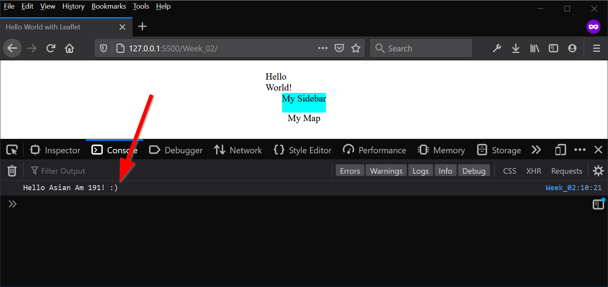
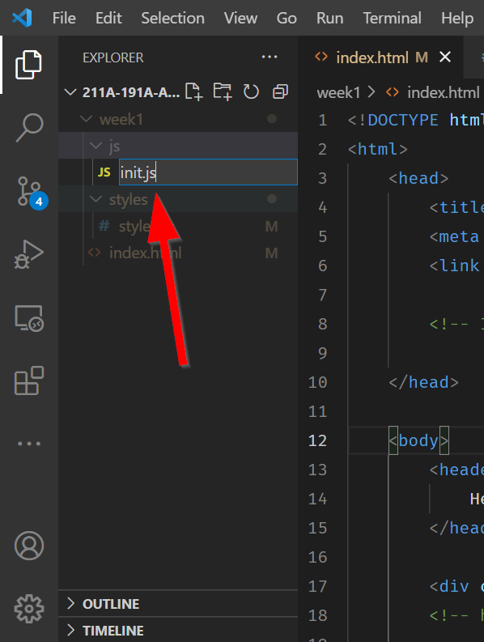
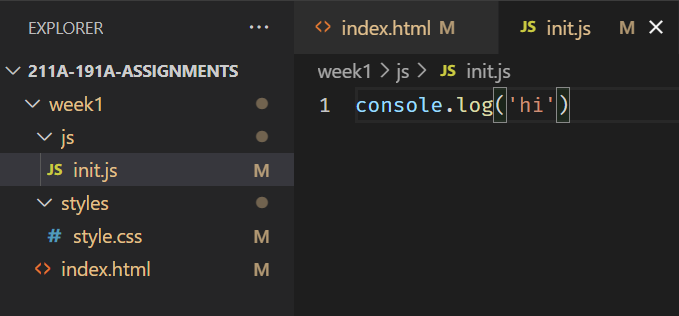

# Basics of JavaScript

JavaScript makes sure our page knows how to function and react. There are different frameworks for JavaScript, like React.js and vue.js, but this class will be focusing on vanilla JavaScript with ES7+ standards. All JavaScript must be contained within a script tag. In our `<head>` tag, let's add a `<script></script>` tag.

Sometimes it also becomes important to put JavaScript in the footer tag, why is that? Sometimes you need JavaScript functions to run after the body loads, so putting `<script>` after the `</body>` becomes necessary. This will be relevant when we bring in `Leaflet.js` because `Leaflet` should go in the header, while our `Javascript` comes after, preferrably in the footer.

## Let's a-(variable)-go!

Variables are like "boxes" that hold information. They can be "numbers", "text", or even collections of variables! In programming languages we call those "types" of variables. With JavaScript, variables are automatically assigned types based on their declaration. We'll discuss more next week, but what you need to know for now is how to `declare` variables.

This is an example of a declaration:

``` js
var day = 8;
var name = "Albert";
```

In front you see the `var` keyword that tells the web browser, "Hey this is a variable!". In this example, `day` is a **numeric** type with a value of `8` and `name` is a **string** type. Each type has certain properties and uses, for example you can add **numbers** together using something like `day + day`, but you adding strings will simply concatenate and not total them.

!!! info "What is a keyword?"
    In coding, a **keyword** is a word that tells a program to treat the following text, numbers, or characters in a specific way. This means you **CANNOT** name a variable `var`, Jar Jar Binks cousin Var Var Binks will is VARy bad for JavaScript to see! i.e. `#!js var var`

With JavaScript ES7, we no longer use the `var` keyword, but instead `let` and `const` keywords to declare variables. They get declared in the same way:

```js
let day = 8; //(1)!
const name = "Albert"; // (2)!
```

1. The `let` keyword **LETS** a variable CHANGE! :smile:
2. The `const` keyword declaration keeps a variable **CONST**ant!
## Let vs Const vs Var

!!! important "What is the difference?"

    1. `#!js let` declaration allows a variable to change
    2.  `#!js const` means a variable is constant and will never change.
    3. `#!js var` can be both changed and never changed depending on where it was declared! VERY PROBLEMATIC!

Because `#!js var` can be changing (mutable) and unchanging at the same time, so it was broken off into two variable types, `#!js let` and `#!js const`. 

So, bye bye `#!js var` and `#!js LET` us welcome our new `#!js CONST` variables to the programming world.

!!! tldr "TLDR"
    **DO NOT USE** `#!js var` unless you need to code for old browsers (mainly Internet Explorer).

## Console.log()
By itself, our script tag does nothing. So, one **VERY** important JavaScript method that we should familarize ourself with is `#!js console.log()`, because it allows us to test our code without things showing up in the webpage.

Add the following script:
```html
<script>
    console.log('Hello Asian Am 191! :)');
</script>
```

## Nothing happened?! What!?

??? note "Someone.."
    CONSOLE(log) me :cry:

Actually, you are about to unlock your full web developer potential!

In Firefox, ==right click== anywhere on the page and the click ==Inspect Element==:


This opens the ==Developer Toolbar==!! You can also find it by going to the **Menu** and going to **Web Developer** and then **Web Developer Tools**.

Click on the ==:material-console: Console== button:


Yay! Our message is there!



## Linking to another JavaScript file

Similar to the CSS files, we can move the JavaScript file into its own folder to avoid cluttering the HTML file. Importing libraries is the main way we level up our webpage.

BUT!!! Instead of `<link>` we use the `<script>` tag:

```html
 <script src="YOUR_SCRIPT_NAME.js"></script> 
```

The `#!js src` attribute is location of your file.

# ⚽ In-class Exercise #2

!!! help "Tasks"
    1. Create a new folder called `js`
    2. Add our script in there
    3. Get our message to show up in the console

<details>

<summary><b>Answer</b></summary>

1. Click on the ==`New Folder` :material-folder-plus:== button:


2. Type in `js`:


3. Click on the ==New File :material-file-plus:== button:



4. Give it a name, like `init.js`



5. Within `index.html` before the end of the `<body>` element include the following:

```js hl_lines="4" title="index.html"
        //
        // ... HTML Truncated for brevity ...
        // 
        <script src="./js/init.js"></script>
    </body>
<html>
```

</details>

??? danger "Warning"
    Never include `<script></script>` tags inside of a Javascript file, those are `HTML elements`!!!
