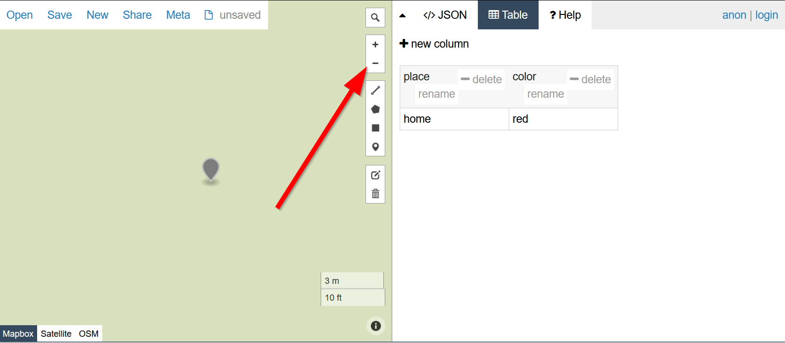
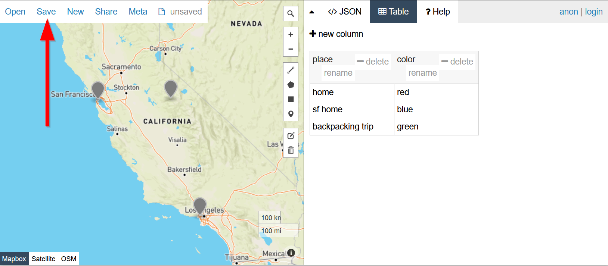

# Adding a GeoJSON file

## The power of people-based web mapping

Let's put to practice what web development and GIS can do for empowering our own stories.

Head over to GeoJSON.io:
[http://www.geojson.io/](http://www.geojson.io/)

Click on the marker tool:


Click on a location of interest to you:


Add a data column:


Call it ==`place`== and click "OK":


Click inside the ==`place`== column


Type in a description for the place, in this case I called it `home`.

{: style="max-width:200px"}

Zoom out:


Click the edit button:


Click the move the marker to the adjust the location:


Save your edit:


Repeat these steps until you have a few more points.

Add another column called "color", to put some color to your map later.


WHen you are done, save your file:



Click ==geoJSON==:


Download the file to your computer:

{: style="max-width:300px"}

Copy the file into your project folder:


## FETCH and THEN

We will use the JavaScript [Fetch API](https://developer.mozilla.org/en-US/docs/Web/API/Fetch_API/Using_Fetch) to get our geojson file and then add it to our map. In JavaScript whenever you see a `.` after a parenthesis`()`, it means you are ==chaining== a command to follow it. In this case we are chaining a `then` method. 

```js 
fetch("map.geojson")
    .then(response => { //(1)! 
        return response.json();
    })
    .then(data =>{ //(2)!
        // Basic Leaflet method to add GeoJSON data
        L.geoJSON(data).addTo(map)//(3)!
    });
```

1.     Here is our first chain, we are trying to `fetch` our **geojson** file.
2.     This is our next chain, we are trying to add it to our map!
3.     The `addTo(map)` is similar to our `marker.addTo(map)` function call!

The map should now have a blue tint over it and you cannot interact with it. Not really useful.

### Clickable GeoJSON

This is the basic Leaflet recipe for a clickable geojson:

```javascript
// the leaflet method for adding a geojson that is red in color:
L.geoJSON(geojsondata, {
    style: function (feature) {
        return {color: 'red'};
    }
}).bindPopup(function (layer) {
    return layer.feature.properties.name;
}).addTo(map);
```

We are going to put that code right into our `L.geoJSON(data)` line, but we will replace `geojsondata` with `data` that is being chained from our `then` method:

```javascript
fetch("map.geojson")
	.then(response => {
		return response.json();
		})
    .then(data =>{
        // Basic Leaflet method to add GeoJSON data
                        // the leaflet method for adding a geojson
            L.geoJSON(data, { // (1)!
                style: function (feature) {
                    return {color: 'red'};
                }
            }).bindPopup(function (layer) {
                return layer.feature.properties.name; //(2)!
            }).addTo(map);
        });
```

1.     This is where we added the clickable geoJSON recipe!!
2.     Notice we are going to return the `properties`'s name here!

Notice `layer.feature.properties.name`, this is the `name` field that we created in https://www.geojson.io! 

Now that when you click on the map, that name shows up!


```javascript
fetch("map.geojson")
    .then(response => {
        return response.json()
    })
    .then(data =>{
        // Basic Leaflet method to add GeoJSON data
        L.geoJSON(data)
        .bindPopup(function (layer) {
            return layer.feature.properties.place;
        }).addTo(map);
    })
```

Try clicking on our markers now!!
### Utilize our color property

We will expand our `L.geoJSON` by adding a `pointToLayer` property by adding a comma and object afterwards `L.geoJSON(data, {HI! THIS IS A NEW OBJECT!})`. Don't sweat the details too much when you see `function` because we'll talk about those in the next module! 

But all you need to know for now is that this `pointToLayer` property takes our data and creates `L.circlemarkers` from them that use our `color` that we defined in the `color` column on https://www.geojson.io! 

```javascript
        L.geoJSON(data, {
            pointToLayer: function (feature, latlng) {
                return L.circleMarker(latlng, {color: feature.properties.color});
            }
```

Now think about how empowering it was for you to be able to add data to the map yourselves. Whether you were clicking random spots or trying to find your old favorite places to visit, the ability to mark things is a reclaiming of mapping for yourself. This sense of staking a claim is what is meant when we refer to "empowering community voices".

## 🏁Last Checkpoint

We only changed our `init.js` file, so it should look like the following:

```js title="js/init.js" linenums="1" hl_lines="25-39"
// declare variables
let zoomLevel = 5;
const mapCenter = [34.0709,-118.444];

// use the variables
const map = L.map('the_map').setView(mapCenter, zoomLevel);

L.tileLayer('https://{s}.tile.openstreetmap.org/{z}/{x}/{y}.png', {
    attribution: '&copy; <a href="https://www.openstreetmap.org/copyright">OpenStreetMap</a> contributors'
}).addTo(map);

// create a function to add markers
function addMarker(lat,lng,title,message){
    console.log(message)
    L.marker([lat,lng]).addTo(map).bindPopup(`<h2>${title}</h2>`)
    return message
}

// use our marker functions
addMarker(37,-122,'home','home land!')
addMarker(32,-118,'work','where i work land!')
addMarker(39,-119,'location 1','random location')
addMarker(36,-120,'location 2','another random location')

fetch("map.geojson")
    .then(response => {
        return response.json()
    })
    .then(data =>{
        // Basic Leaflet method to add GeoJSON data
        L.geoJSON(data, {
            pointToLayer: function (feature, latlng) {
                return L.circleMarker(latlng, {color: feature.properties.color});
            }
        })
        .bindPopup(function (layer) {
            return layer.feature.properties.place;
        }).addTo(map);
    })
```

Now you should be ready to take on the [lab assignment](lab_assignment.md)!