# Our community-based survey

## Creating a new Google Form

Navigate to Google Forms and click on "Blank":


Give a title to your Google Form by clicking on "Untitled Form":


Add a little description about the survey form here. For our example we will be collecting stories about vaccinations during COVID-19.

## Adding a Google Form Question

Click on the "Add Question" button to add a question:


Start typing "Location" and Google will automatically guess the question type for you. 

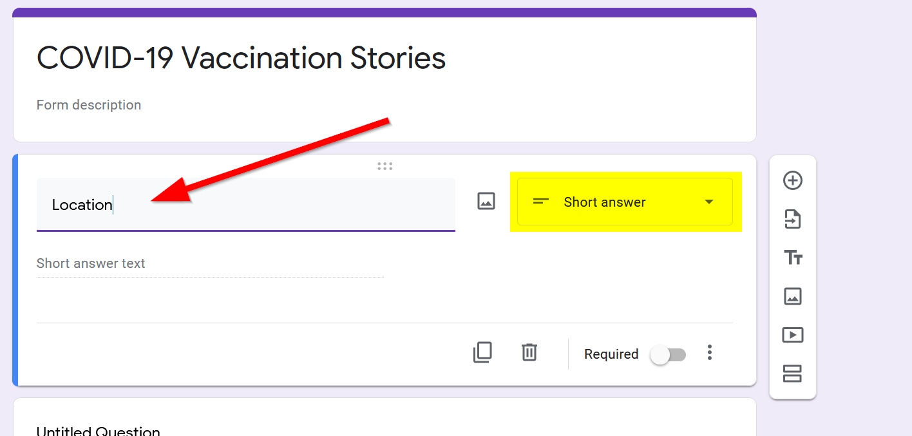

You can fill in descriptions below the question to help with answering by clicking on the "more" triple dots:
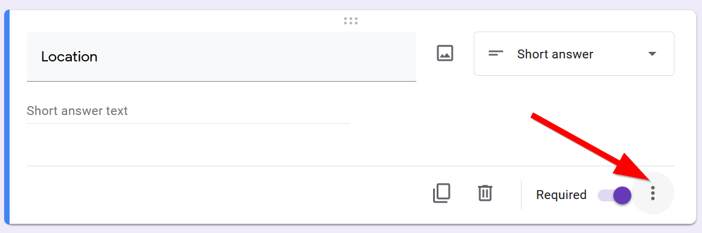

Then going to description:
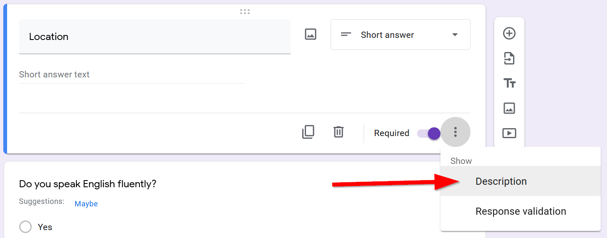

And typing out a help description:


You can check the "required" mark to make this question necessary to move on.
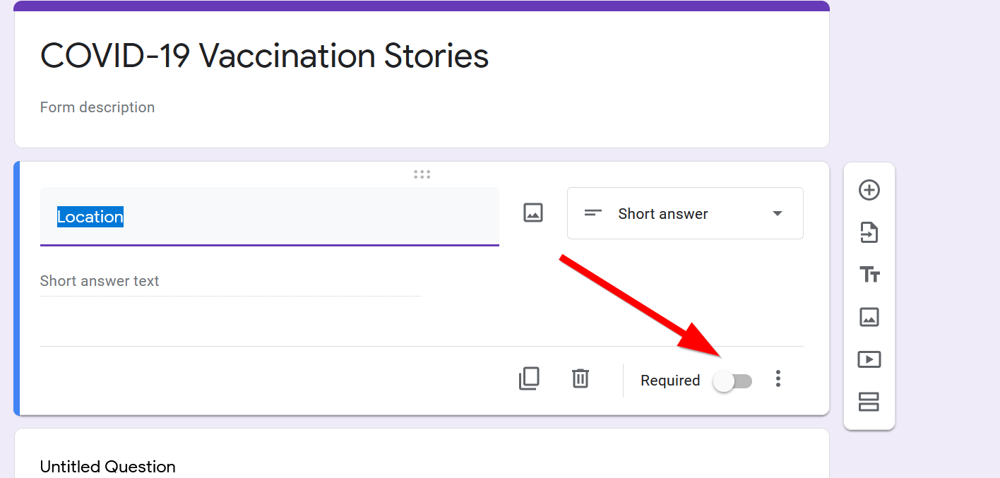

## Conditional Questions

Add a relevant question to help guide the user about the survey, `Do you speak English fluently`?"`


Click on the `triple dots`:


Select `Go to section based on answer`:


## Adding new sections

Add a new section:
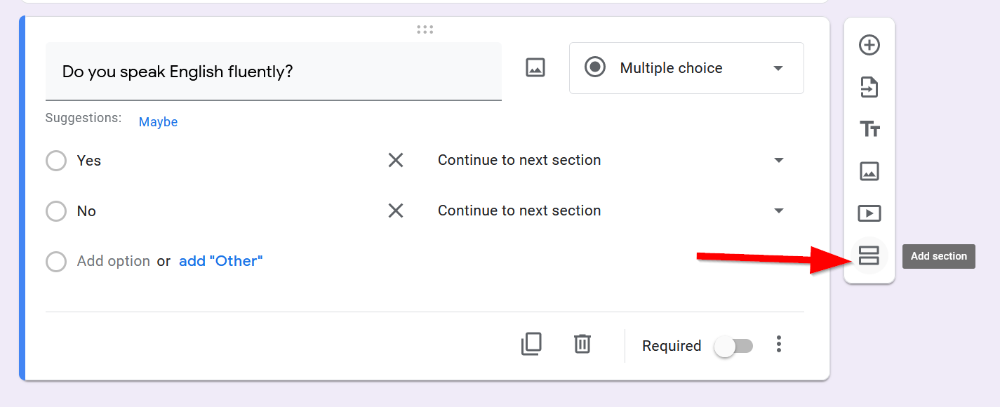

Title it `Language Details`


Add one question on `What language do you primary speak at home`?
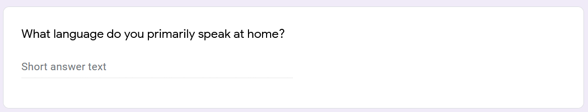

And another on `What is your age`?


Go back to the question `Do you speak English fluently?` and for `No`:


Choose `Go to Section 2`.


Scroll to the bottom and add a new section:


Call it `Vaccination Story` and add a new question:

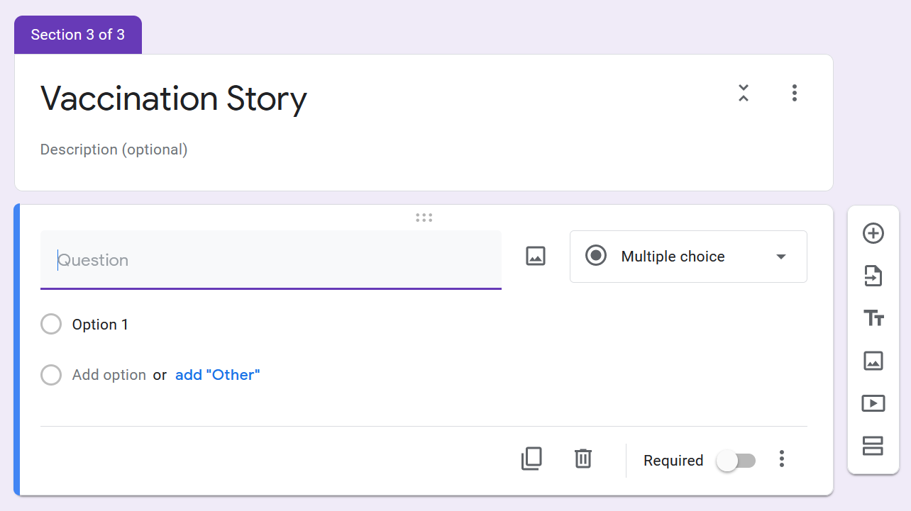

Add the question:

`Would you be comfortable with sharing your story?`
- >Yes
- >No

Make it a required question.

### ⚽In-class Exercise #1 - Open Ended Questions

!!! tldr "Tasks
    1. Add two open-ended questions to your form
    2. Replace the hard coded values of `const map = L.map('the_map').setView([34.0709, -118.444], 5);` with an `object`.
    3. Get the `object` to show up in the console.

!!! complete "Bonus"

    Feel free to make a branching question to the `open-ended questions`, so if some one chooses "No" they submit the form and finish.

??? done "Answer"
    Some open-ended questions can be the following:

    > How did you make the appointment? 

    > How did you get to the location?

    Make sure they are both `Paragraph` answer types:

    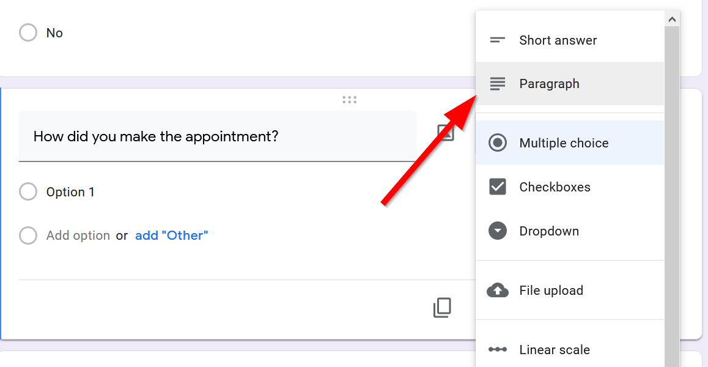


## Wrapping the form up

Go back to `Do you speak English fluently` and make `Yes` go to `Section 3`:
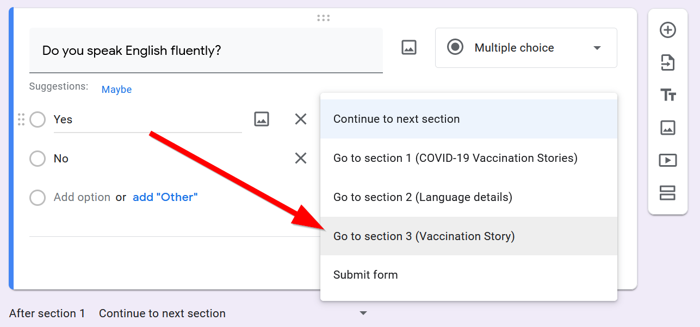

Your final form should look something like this:
https://forms.gle/E8xBqKLJNJyvxGcK8

### Sharing your form

Click the ==Send== button to share your form


### Embeding your form

Under the `Send` button menu, click on the ==Embed== tab

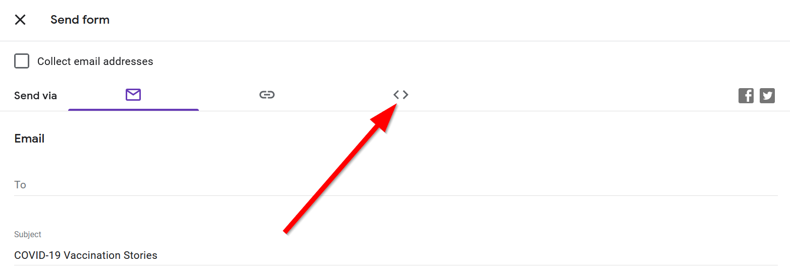

Copy the Embeded HTML by clicking the `Copy` button:

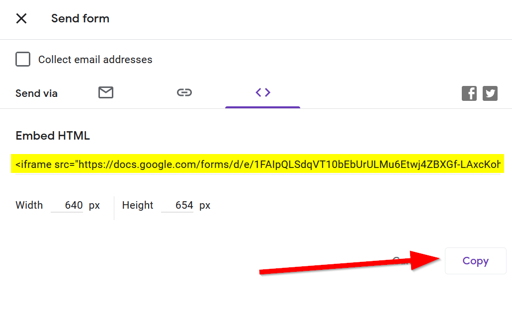

Go back to `index.html` and paste the embedded HTML into the `contents` div:

```html hl_lines="3"
<div id="contents">
    <!-- page contents can go here -->
    <iframe src="https://docs.google.com/forms/d/e/1FAIpQLSdqVT10bEbUrULMu6Etwj4ZBXGf-LAxcKohAINFbIdZmHS6OA/viewform?embedded=true" width="640" height="654" frameborder="0" marginheight="0" marginwidth="0">Loading…</iframe>
</div>
```

### Accessing the Responses

Click on `Responses`:

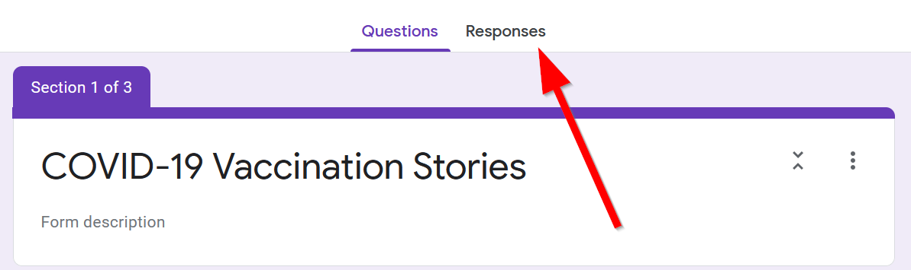

Click on the Google Spreadsheet button:


Change the title and click on `Create` button:


Open the response Google Sheet by clicking open or the Google Sheets icon:

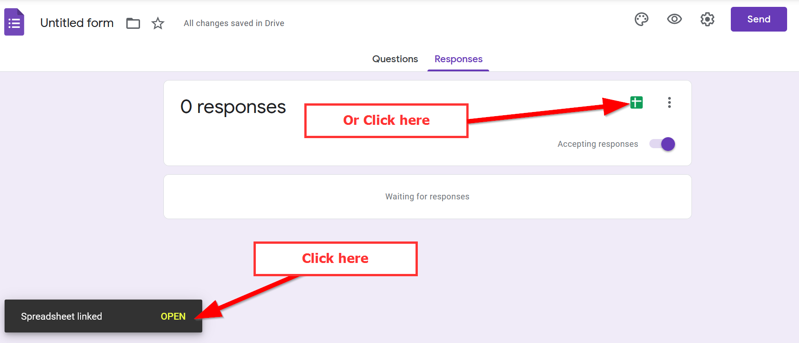
