# Geocoding with Google

## Revisiting Functions

Open up your Google Sheet from part 1.

Go to column for `Location` and remember what column it is, for me it is `C`:

{: style="max-width:500px"}

Next, add two columns, one for `lat` and another for `long`:

{: style="max-width:500px"}

Now click on ==**Extensions**==

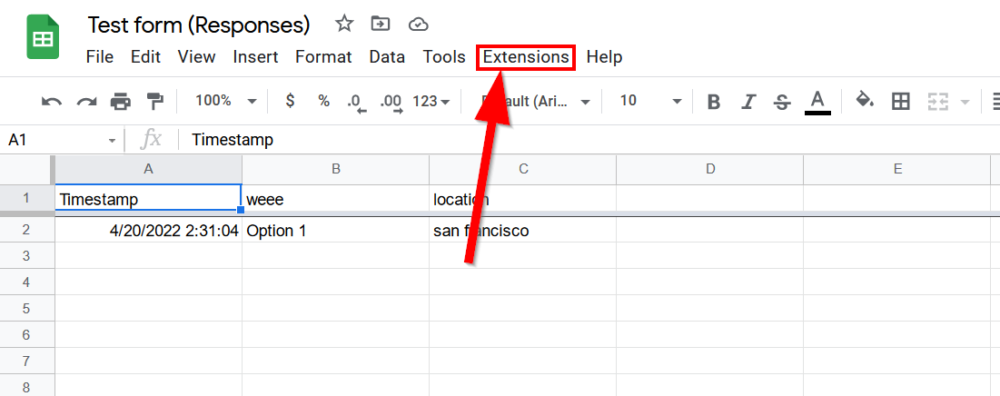{: style="max-width:500px"}

Now click on ==**Apps Script**==

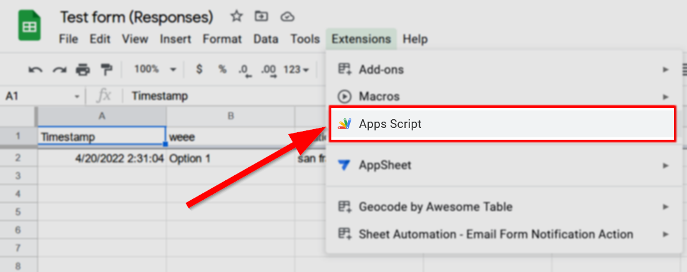{: style="max-width:500px"}

When you first launch, you will see a blank ==myFunction()== select it and get ready to paste over it:

{: style="max-width:500px"}

Copy and paste the following code into the entire script:

```js title="Google's Script Editor" linenums="1"
function myFunction() {
  let sheet = SpreadsheetApp.getActiveSheet();
   
  let range = sheet.getDataRange();
  let cells = range.getValues();
   
  let latitudes = [['lat']]; //(1)!
  let longitudes = [['lng']]; //(2)!
   
  for (let i = 0; i < cells.length; i++) {
    // change cells[i][2] if your address is not in column 'C', for example cells[i][1] for column 'B' or cells[i][3] for column D
     addressColumn = cells[i][2] //(3)!
     let lat = lng = 0;
    if (i > 0) {
      if (addressColumn){
    let address = addressColumn;
    console.log(address)
 
    if(address){
      let geocoder = Maps.newGeocoder().geocode(address);
      let res = geocoder.results[0];
        if (res) {
          lat = res.geometry.location.lat;
          lng = res.geometry.location.lng;
        }
      }
    }
    latitudes.push([lat]);
    longitudes.push([lng]);
    }
  }
  sheet.getRange('D1') // this is your latitude column //(4)!
  .offset(0, 0, latitudes.length)
  .setValues(latitudes);
  sheet.getRange('E1') // this is your longitude column //(5)!
  .offset(0, 0, longitudes.length)
  .setValues(longitudes);
  Utilities.sleep(5000)
}
```

1.       This defines the column as latitude to be `lat`
2.       This defines the column as longitude to be `lng`
3.       `#!js cells[i][2]` the `2` is `number` that your **address** column is in minus 1!! You have to subtract 1 because JavaScript starts counting at `0`!!! For example, column A is `0`!
4.       Make sure this column letter matches your `**latitude**` column!!
5.       Make sure this column letter matches your `**longitude**` column!!

!!! note "JavaScript arrays start at 0"
    Most programming have two types of indexing, `0` indexed or `1` indexed, which means the number that they start counting lists from. **JavaScript** is `0` indexed, meaning a list with **4** things starts from `0` and ends at `3`, like this: `[0,1,2,3]`. 
    
    This is important when we call items from a list and want to get the right item from it!! For example, we have to get the fourth item in the example array like this, `#!js let theFourthItem = myArray[3]`.

Click on the ==Save Icon :material-content-save:== to save your script:

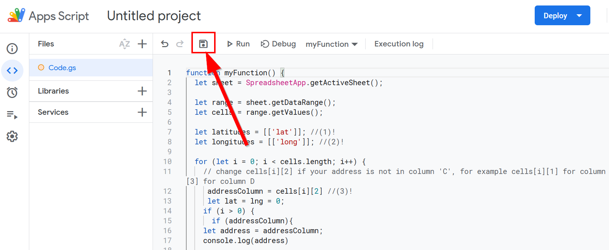{: style="max-width:500px"}

Click on the ==**Run**== button to test the script:

{: style="max-width:500px"}

You should get a prompt asking for `Authorization`, click ==**Review permissions**==:

{: style="max-width:500px"}


Select your ==**Google Account**== to continue:

{: style="max-width:300px"}


Click on ==Advanced==:

{: style="max-width:300px"}

Click on ==**Go to Untitled Project (unsafe)**==

{: style="max-width:300px"}

Click on ==**Allow**==

{: style="max-width:300px"}

!!! note "Do you trust yourself? :thinking:"
    Essentially, anyone can write Google Scripts, so Google is making sure that the script is associated with your account before giving it access to this particular spreadsheet.

Click on ==**Save**==:

{: style="max-width:300px"}

If it ran successfully then you should now see `latitude` and `longitude` filled in the Google Sheet!

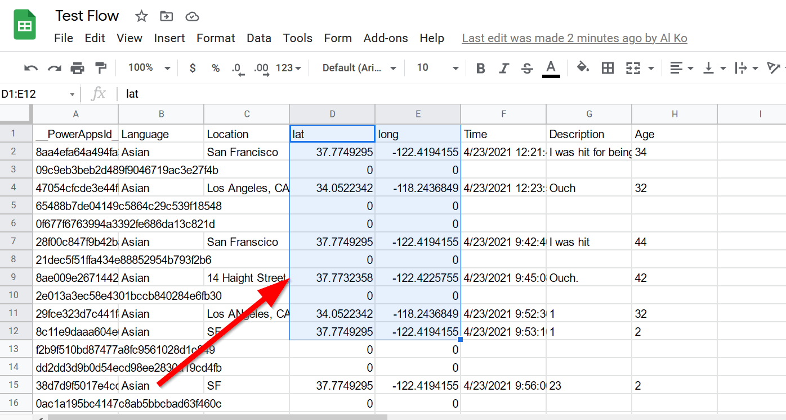{: style="max-width:500px"}

## Geocoding on each submission with a trigger

Go back to the Google Scripts and click on the ==triggers icon :material-timer-outline:==

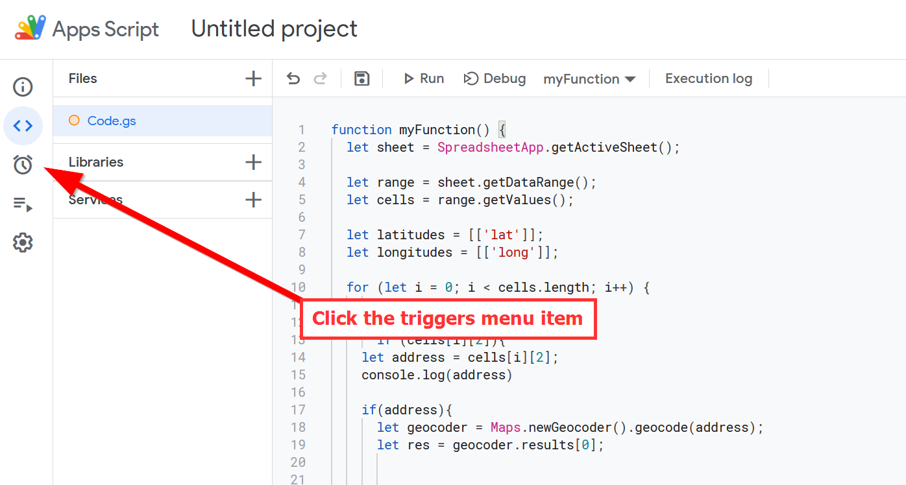{: style="max-width:500px"}

Click on ==:heavy_plus_sign: **Add Trigger**==:

{: style="max-width:500px"}

Click on ==**Select event type**==:

{: style="max-width:500px"}

Change to ==**On Form Submit**== so that everytime the the form gets submitted a new record gets latitude/longitude added too!

{: style="max-width:500px"}

Click ==**Save**==:

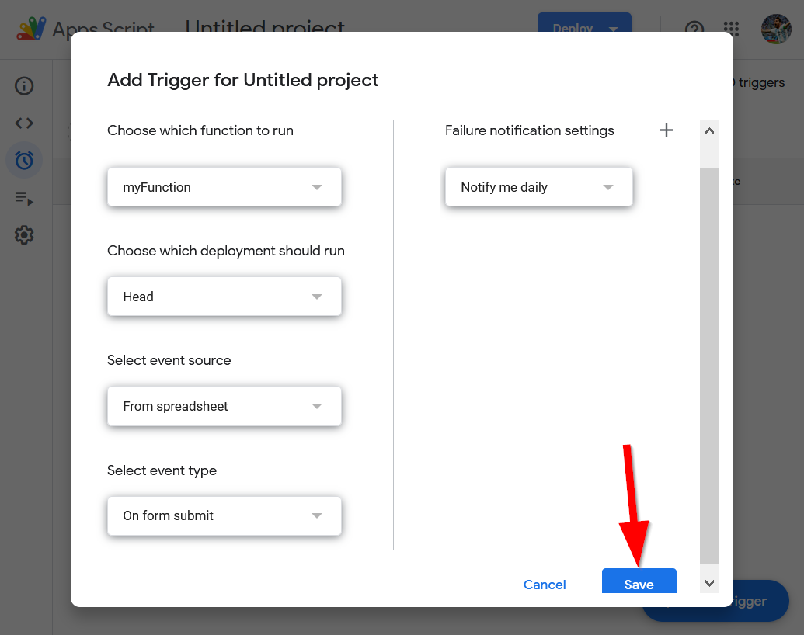{: style="max-width:500px"}

A pop-up should appear, but if you have a pop-up blocker like on FireFox, then you may have to click on `Options`:

{: style="max-width:500px"}

Then ==Allow== this particular popup to appear.

{: style="max-width:300px"}

!!! note "Authorization again?"
    This is the same authorization as before, but it is for the `Trigger` not the application!

Select your ==**Google Account**== to continue:

{: style="max-width:300px"}

Click on ==Advanced==:

{: style="max-width:300px"}

Click on ==**Go to Untitled Project (unsafe)**==

{: style="max-width:300px"}

Click on ==**Allow**==

{: style="max-width:300px"}

Click on ==**Save**==:

{: style="max-width:300px"}

Congratulations, now each time a form gets submitted you will be able to map the locations:

{: style="max-width:500px"}

### ⚽In-class Exercise #2 - Test your form!

!!! tldr "Tasks"
    1. Add 2-3 locations to your Google Form and see if the new locations work. 
    2. Check to see if the locations are accurate or not!
    3. What type of locations do not show up?

??? complete "Answer"
    Locations that do not show up are those that are blank or are not able to be located by the Google Geocoder.

## Publishing your survey

Now that our data is able to be geocoded, the final step is to publish the spreadsheet so we can  can bring it into our HTML file through JavaScript next week.

Go to ==**File**==:

{: style="max-width:500px"}

Click on ==**Sharing**==:

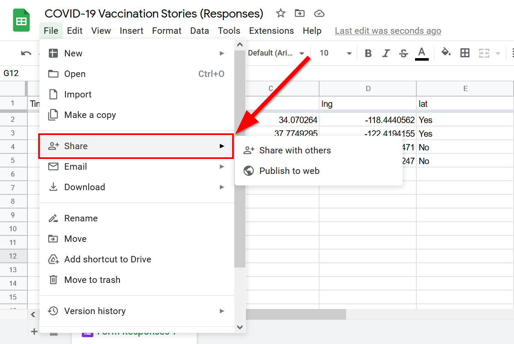{: style="max-width:500px"}

Click on ==**Publish to web**==:

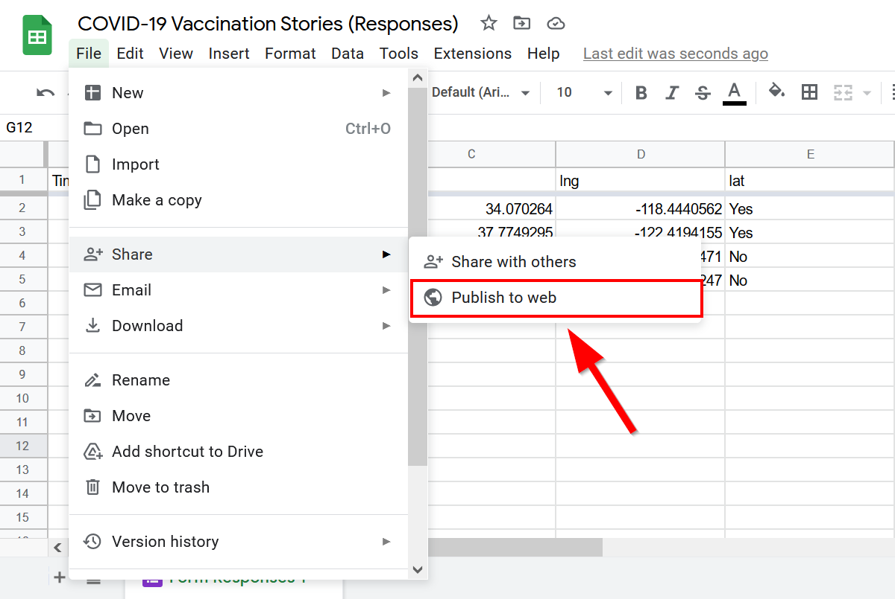{: style="max-width:500px"}

Click on ==**Webpage**==:

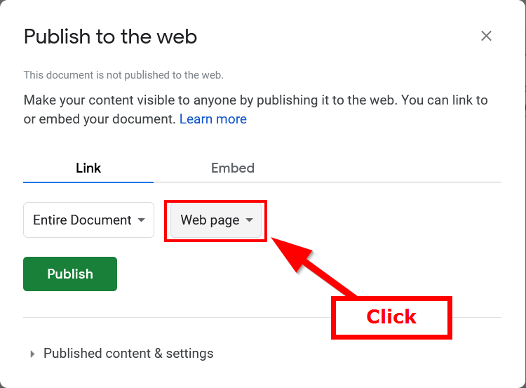{: style="max-width:500px"}

Choose ==**CSV**==:

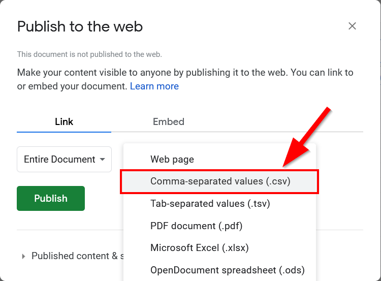{: style="max-width:500px"}

Click ==**Publish**==:

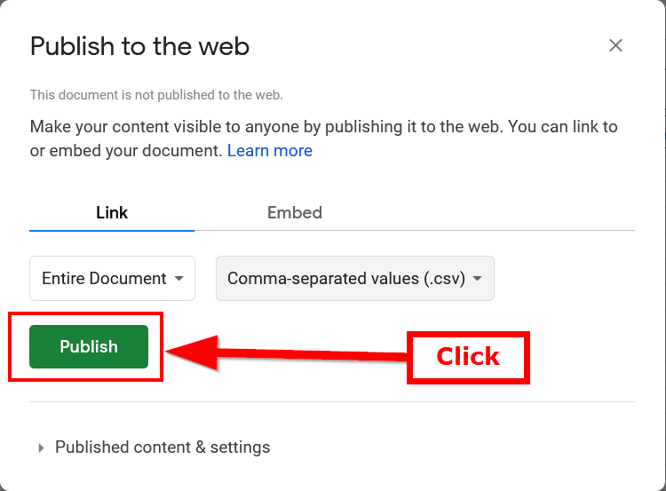{: style="max-width:500px"}

If this warning pops-up click on ==**OK**==:

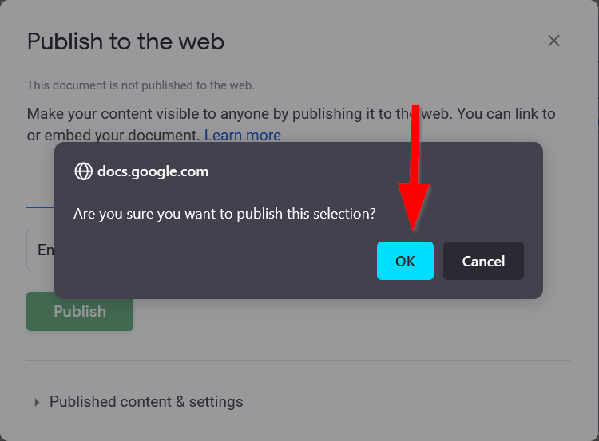{: style="max-width:500px"}


Copy the URL in the address bar:

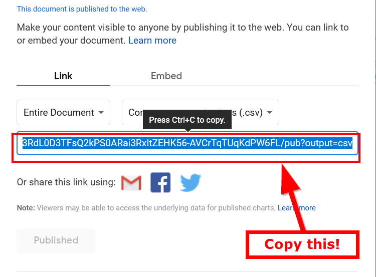{: style="max-width:500px"}

Paste it into your dataUrl variable like so:

```js title="js/init.js"
const dataUrl = "https://docs.google.com/spreadsheets/d/e/2PACX-1vSpOaH94y-oguAqbtcvZRyKdrEYiT1JOzW0jmmreznYS8THdQTYQ6cUB7J_68SZLgjpXbB_FY_nDf2A/pub?output=csv"
```

Uncomment the `loadData(url)` function to test if it's working:

```js
// we will put this comment to remember to call our function later!
loadData(dataUrl)
```

Since there is only a `console.log()` in the `loadData()` function, you have to open the browser's console to check.

## 🏁Last Checkpoint

Your `init.js` should look like the following:

```js title="js/init.js" linenums="1" hl_lines="18 20 29-31"

// declare variables
let mapOptions = {'center': [34.0709,-118.444],'zoom':5}

// use the variables
const map = L.map('the_map').setView(mapOptions.center, mapOptions.zoom);

L.tileLayer('https://{s}.tile.openstreetmap.org/{z}/{x}/{y}.png', {
    attribution: '&copy; <a href="https://www.openstreetmap.org/copyright">OpenStreetMap</a> contributors'
}).addTo(map);

// create a function to add markers
function addMarker(lat,lng,title,message){
    console.log(message)
    L.marker([lat,lng]).addTo(map).bindPopup(`<h2>${title}</h2> <h3>${message}</h3>`)
    return message
}

const dataUrl = "https://docs.google.com/spreadsheets/d/e/2PACX-1vSpOaH94y-oguAqbtcvZRyKdrEYiT1JOzW0jmmreznYS8THdQTYQ6cUB7J_68SZLgjpXbB_FY_nDf2A/pub?output=csv"

function loadData(url){
    fetch(url)
        .then(response => {
            console.log(response)
            return response
        })
        .then(data =>{
            // do something with the data
        })
}
// we will put this comment to remember to call our function later!
loadData(dataUrl)
```

There is no lab assignment for this week, but you should check to make sure your lab is working  because you will use this lab for next week's assignment!


The week's [final template](4.md) is provided for you to double check if something isn't working.
