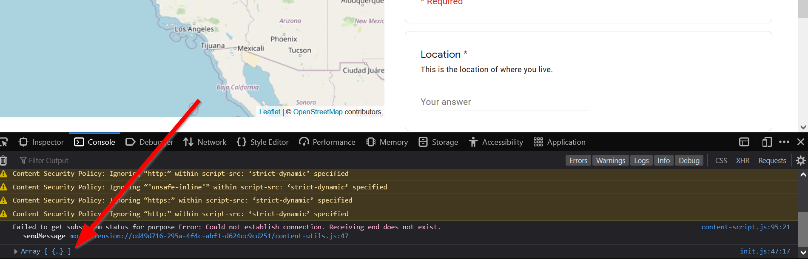
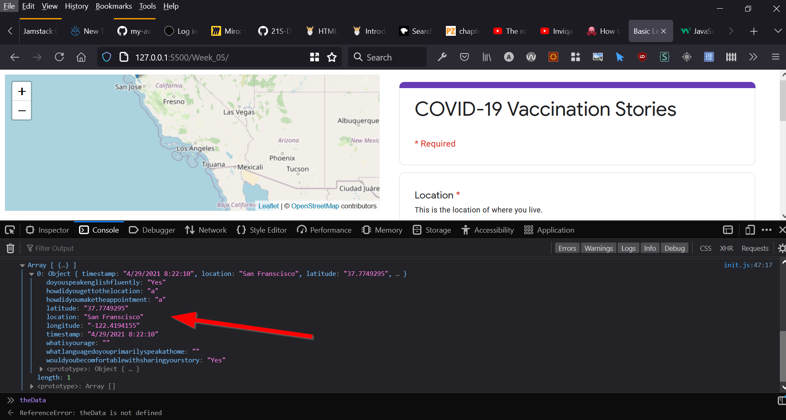

Now, let's add the function to clean the data up after our data gets returned:

```js
let url = "https://spreadsheets.google.com/feeds/list/1j3a2do9HIS6xvpBsKMjmI4soNaqGdlnIkwYQHktmp1U/oua1awz/public/values?alt=json"

fetch(url)
	.then(response => {
		return response.json();
		})
    .then(data =>{
        // console.log(data)
        processData(data)
    }

```
Open the debug console and click on our array:



Our data should look nice and clean now! 



Time for the final step..

## Turning our data into markers
Now that our data is cleaned we can use a `.forEach` to `loop` through our data and run the `addMarker()()` function on them. We will add this in our `processData` function.

> js/init.js
```js
function processData(theData){
        const formattedData = [] /* this array will eventually be populated with the contents of the spreadsheet's rows */
        const rows = theData.feed.entry // this is the weird Google Sheet API format we will be removing
        // we start a for..of.. loop here 
        for(const row of rows) { 
          const formattedRow = {}
          for(const key in row) {
            // time to get rid of the weird gsx$ format...
            if(key.startsWith("gsx$")) {
                  formattedRow[key.replace("gsx$", "")] = row[key].$t
            }
          }
          // add the clean data
          formattedData.push(formattedRow)
        }
        // lets see what the data looks like when its clean!
        console.log(formattedData)
        // we can actually add functions here too
        formattedData.forEach(addMarker)
}
```
Open the console and look at our data, we should take note of our field names and the be sure to add them to our markers. Also notice that our markers haven't showed up yet!  That's because we have to modify the `addMarker()` function to use the `data` object:

```js
// old code
// function addMarker(){
//         L.marker([lat,lng]).addTo(map).bindPopup(`<h2>${name}</h2>`)
//         return name    
// }

function addMarker(data){
        // console.log(data)
        // these are the names of our fields in the google sheets:
        L.marker([data.latitude,data.longitude]).addTo(map).bindPopup(`<h2>${data.timestamp}</h2>`)
        return data.timestamp
}
```
Final Code:

> js/init.js
```js
const map = L.map('map').setView([34.0709, -118.444], 5);

L.tileLayer('https://{s}.tile.openstreetmap.org/{z}/{x}/{y}.png', {
    attribution: '&copy; <a href="https://www.openstreetmap.org/copyright">OpenStreetMap</a> contributors'
}).addTo(map);

function addMarker(data){
        // console.log(data)
        // these are the names of our fields in the google sheets:
        L.marker([data.latitude,data.longitude]).addTo(map).bindPopup(`<h2>${data.timestamp}</h2>`)
        return data.timestamp
}

let url = "https://spreadsheets.google.com/feeds/list/1j3a2do9HIS6xvpBsKMjmI4soNaqGdlnIkwYQHktmp1U/oua1awz/public/values?alt=json"

fetch(url)
	.then(response => {
		return response.json();
		})
    .then(data =>{
                // console.log(data)
                formatData(data)
        }
)


function formatData(theData){
        const formattedData = [] /* this array will eventually be populated with the contents of the spreadsheet's rows */
        const rows = theData.feed.entry
        for(const row of rows) {
          const formattedRow = {}
          for(const key in row) {
            if(key.startsWith("gsx$")) {
                  formattedRow[key.replace("gsx$", "")] = row[key].$t
            }
          }
          formattedData.push(formattedRow)
        }
        console.log(formattedData)
        formattedData.forEach(addMarker)        
}
```

> index.html
``` html
<!DOCTYPE html>
<html>
    <head>
        <title>Basic Leaflet Map</title>
        <meta charset="utf-8" />
        <link rel="shortcut icon" href="#">
        <link rel="stylesheet" href="style/style.css">

        <!-- Leaflet's css-->
        <link rel="stylesheet" href="https://unpkg.com/leaflet@1.7.1/dist/leaflet.css" />

        <!-- Leaflet's JavaScript-->
        <script src="https://unpkg.com/leaflet@1.7.1/dist/leaflet.js"></script>
    </head>
    
    <body>
        <div id="map"></div>
        <div id="survey">
        <!-- this is the iframe for our survey -->
            <iframe src="https://docs.google.com/forms/d/e/1FAIpQLSdqVT10bEbUrULMu6Etwj4ZBXGf-LAxcKohAINFbIdZmHS6OA/viewform?embedded=true" width="640" height="654" frameborder="0" marginheight="0" marginwidth="0">Loading…</iframe>
        </div>
        <script src="js/init.js"></script>
    </body>
</html>
```

>style/style.css
```css
body{
    display:grid;
    grid-template-columns: 1fr 1fr; /* this creates an even two column layout*/
    grid-template-areas: "mappanel sidepanel" /* this creates one row with map panel on the left and sidepanel on the right */
}

#map{
    height:90vh;
    grid-area: mappanel;
} 

#survey{
    grid-area: sidepanel;
} 
```

Congratulations on finishing the lab! You only need to add a few data fields in order to finish the lab assignment.
