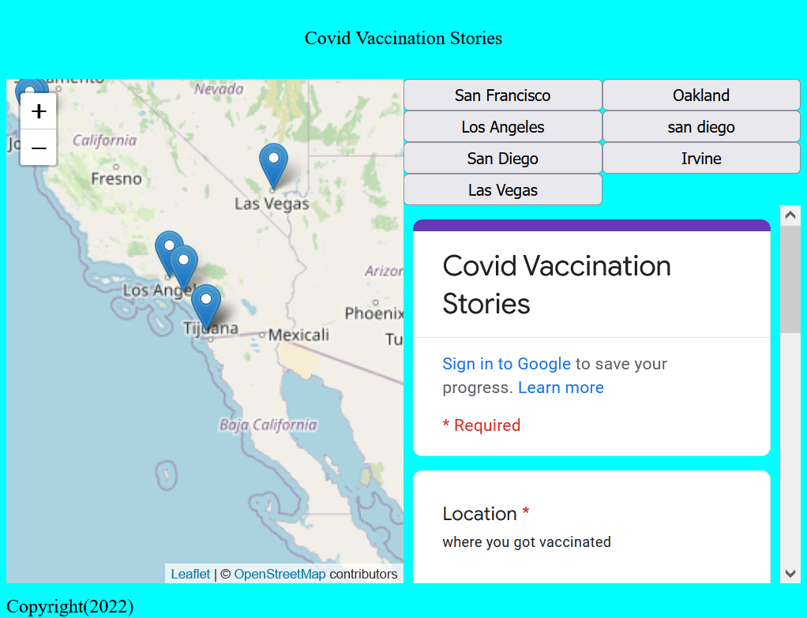
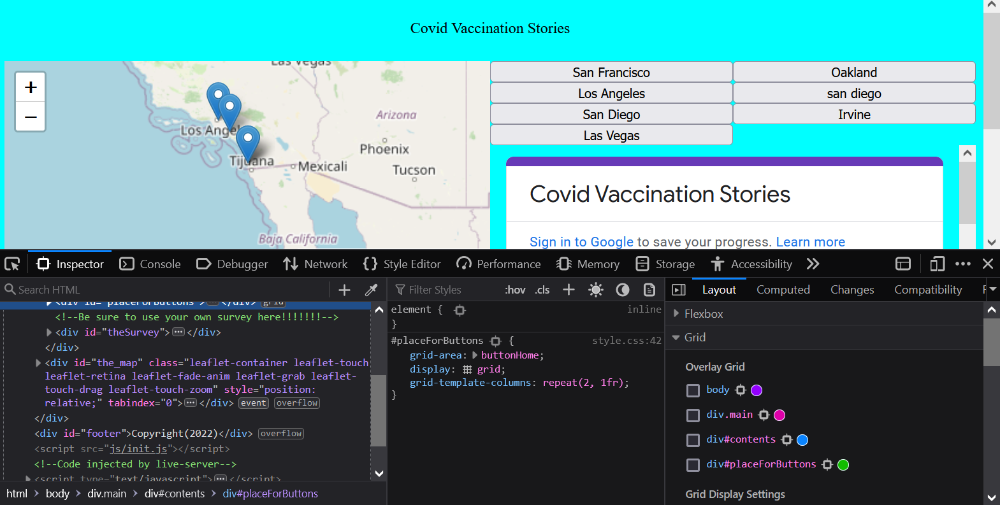

# Home C-S-Stretch: Layouts!

Let's add some text to our header in the HTML:


```html title="index.html" linenums="19" hl_lines="3"
    <body>
        <header>
            COVID Vaccination Stories
        </header>
```

In the `style.css` file and go to the `body` selector. Then change `grid-template-rows` to the following: `grid-template-rows: 50px auto auto;`.

```css title="styles/style.css"
body{
    display: grid;
    grid-template-rows: 50px auto auto;
    grid-template-areas: "header" "main_content" "footer";
    background-color: aqua;
}
```

This creates a small header ontop that is `50 pixels` tall and `auto` fits the content for the main page and footer.

### Adding `gaps` between items

In `CSS-grid` you can add a `gutter` between items that gives a padding in between, as follows:

```css title="styles/style.css" hl_lines="6"
body{
    display: grid;
    grid-template-rows: 50px auto auto;
    grid-template-areas: "header" "main_content" "footer";
    background-color: aqua;
    gap: 10px;
}
```

!!! note "Vertical scroll bar?"
    If you add a gap to the `body` there will be a scroll bar now since it extends the page beyond the initial view port. It is recommended to use gap not with containers that are meant to contain the whole page, like `HTML` or `body`

The `gap` CSS property is very useful for spacing other elements, like buttons!!

### Centering content

You can center the header by going to the `header` selector adding the following CSS property `justify-self: center`:

```css
header{
    grid-area: header;
    justify-self: center;
}
```

If you want to vertical align, then you need to use `align-self:center`

```css
header{
    grid-area: header;
    justify-self: center;
    align-self:center;
}
```


In our `grid-template-columns` we need one more `1fr` for our survey in:

`grid-template-columns: 1fr 1fr 1fr`

Finally, we need to add spaces after the `"header"` and `"footer"` template areas too which indicates which row the template is on:

`grid-template-areas: "header" "mappanel contentpanel" "footer"`

### 🏁CSS Check point
Check to see if your `body` and `header` selector looks like the following:

```css
body{
    display: grid;
    grid-template-rows: 50px auto auto;
    grid-template-areas: "header" "main_content" "footer";
    background-color: aqua;
    gap: 10px;
}

header{
    grid-area: header;
    justify-self: center;
    align-self: center;
}
```

## Grid-ception and automatically fitting content!

While named `grid-template-areas` can be useful, if you have a lot of content, or if the content might grow in number, you can just specify the number that the content should occupy using the `grid-column` property and `repeat`. Additionally, we can start a `subgrid` within a `grid` element to specify which part of an already existing `grid` we want to visualize. 

- [More about `repeat`](https://developer.mozilla.org/en-US/docs/Web/CSS/repeat())

- [More about `subgrid`](https://developer.mozilla.org/en-US/docs/Web/CSS/CSS_Grid_Layout/Subgrid)

Let's apply a `subgrid` and `repeated columns` of 2 to the `#placeForButtons` selector:

```css
#placeForButtons{
    grid-area: buttonHome;
    display:grid;
    grid-template-columns: repeat(2, 1fr);
}
```

This creates a new column after every 2 evenly spaced item!!!

{: style="max-width:500px"}

It even works when you resize the page!
{: style="max-width:500px"}

So cool!!! 

Remember, if you turn on the debugger in Firefox, you can see the multiple grids:

{: style="max-width:500px"}

And there you have it! We've only scratched the surface of CSS Grid, but this is enough for you to complete the lab assignment!