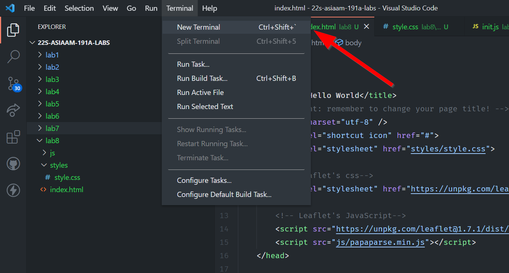
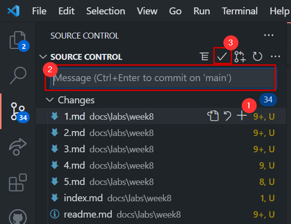
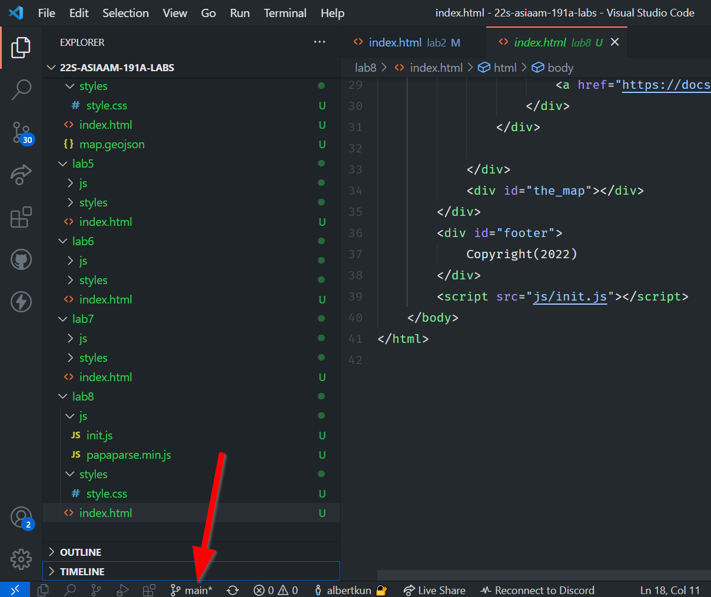
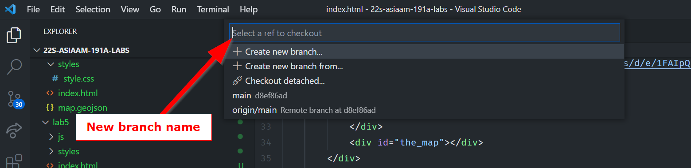

# Clone a new repo

We will be working with the terminal a bit today, so let's open up the terminal by going to the menu bar:


Then clicking on `New Terminal`:



Start by cloning this repo:

```
git clone https://github.com/albertkun/21S-AA191-GitPracticing.git
```

Here are the basic git commands for adding new changes:

```
git add .
git commit -am "message"
git push
```

These commands are identical to what we do in the source control tab in VS Code:



1. Is the `git add .`
2. Is the `git commit` with a `message`
3. Is the `git push`


## Making a new branch

```
git checkout -b helloNewBranch
```
This creates a branch called `helloNewBranch` and switches to it!

You can also make a new branch in VS Code by clicking this button:



You can then create a name for it



### `git add .` your changes to the new branch:
Make some changes and add them to the branch:
```
git add .
```

## Add a message to your commit
```
git commit -am "message"
```

## Push your changes to your new branch

This code creates a new branch called `helloNewBranch` on GitHub to push to:

```
git push --set-upstream origin helloNewBranch
```

You only need to run it when the branch DOES NOT exist on GitHub!!! After the branch is on GitHub, use only need to use `git push`:

```
git push
```
