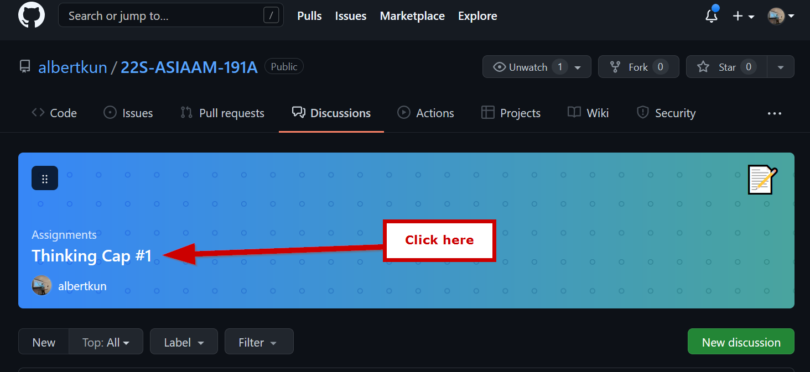

# How to Submit a Thinking Cap Discussion

## Part One: Posting your own discussion
1. Go to the [course repository](https://github.com/albertkun/22S-ASIAAM-191A)

2. Make sure you are signed into your GitHub account. [Click here](https://github.com/signup?ref_cta=Sign+up&ref_loc=header+logged+out&ref_page=%2F%3Cuser-name%3E%2F%3Crepo-name%3E&source=header-repo&source_repo=albertkun%2F211A-ASIAAM-191A) to create one if you have not made one yet.

3. Click on "**Discussions**"

4. Click on the week you are submitting the assignment for, in this example we will be submitting for week 1
5. Respond to the prompt for the week by scrolling down:

6. Write your thoughts and reflection:

7. Click on "**Comment**"

8. The first part of assignment is now complete!

## Part 2: Responding to discussions
9.  Try to look for student posts with no replies. 
10. Click in the box to start your reply
    
11. Type a thoughtful reply and press "**Reply**".

12. Repeat **Steps #9 - #11** for another student.
13. Congratulations on finishing the assignment!
    