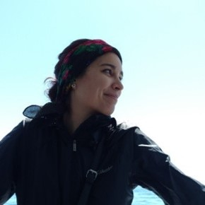

# Week 2 - Humanizing Technology

## Lecture
- [Critical Cartography and Civil Society](../materials/AA191_S_W2_Lecture_2.pdf)
 
### Visiting Voice: Mariah Tso

Mariah Tso is a Diné woman, artist, and GIS Specialist for the [Ralph J. Bunche Center](https://bunchecenter.ucla.edu/) and the [Million Dollar Hoods Project](https://milliondollarhoods.pre.ss.ucla.edu/).

## Lab

- Tales from the JavaScript: Season 2

## Assignments

### Due Wednesday 4/4

- [Lab Assignment #2](../assignments/week1/lab_assignment.md)
  - [Submit using the discussion post](../help/submit.md)!!
- [Pre-lab Reading](../assignments/week2/prelab.md)

### Due Monday 4/11 at 2pm PST

- [Thinking Cap #2](https://github.com/albertkun/22S-ASIAAM-191A/discussions/10)

### Due Wendesday 4/13
<!-- - [Group Assignment #2](../Week_2/Materials/group_assigment_2.md) -->
- [Lab Assignment #2](../assignments/week2/lab_assignment.md)
