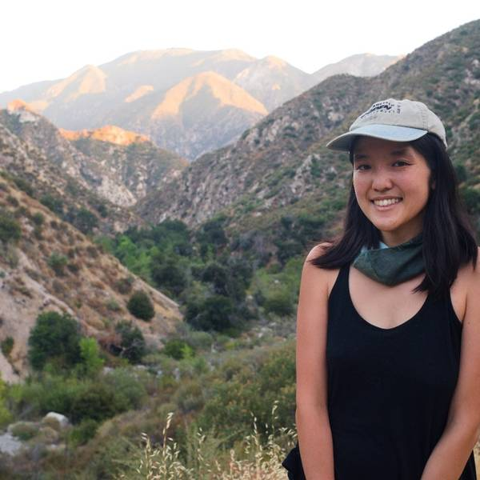

# Week 3 - Open Source and Web Mapping

Date|Type|Description|Slides|Recording|
|---|----|-----------|------|---------|
|4/11|Community-driven approaches to software development|Lecture|Comming soon|Comming soon|
|4/13|Here's GeoJSON and our first user experience|Lab|Comming soon|Comming soon|

## Lecture

- Community-driven approaches to software development

### Visiting Voice: Machiko Yasuda

{: style="max-width:300px"}

Machiko Yasuda is an UCLA alumni formerly at the Daily Bruin, who now codes for the public at [compiler.la](https://compiler.la/). She is also involved in connecting people in LA to their environment in various ways, from teaching confident city cycling to starting a free mapping meetup called [Maptime LA](https://maptimela.github.io/). She is also involved in the non-profit active transportation group [ActiveSGV](https://www.activesgv.org/).

## Lab

- Here's GeoJSONny and our first user experience

## Assignments

### Due Wednesday 4/13

- [Lab Assignment #2](../assignments/week2/lab_assignment.md)
  - [Submit using the discussion post](../help/submit.md)!!
- [Optional: Pre-lab Reading](../assignments/week3/prelab.md)

### Due Monday 4/18

- [**Readings about looking beyond Open Source**](../assignments/week3/reading.md)
- [Thinking Cap #3](https://github.com/albertkun/22S-ASIAAM-191A/discussions/10)

### Due Wendesday 4/20

- [Group Assignment #2](../assignments/week2/group_assignment.md)
- [Lab Assignment #3](../assignments/week3/lab_assignment.md)
