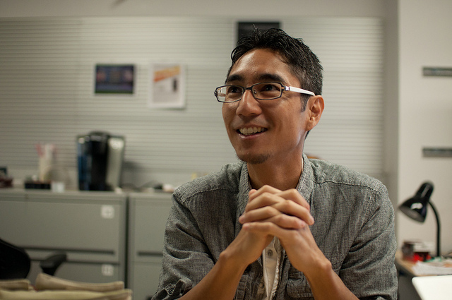

# Week 6 - Human-Centered Design

Date|Type|Description|Slides|Recording|
|---|----|-----------|------|---------|
|5/2|Design DeciCSSions|Lab|[Here](../materials/AA191_S_W6_Lab_6.pdf)|[Here](https://ucla.zoom.us/rec/share/YQ2y-8CigA6it2jZwJ0ne7SY0ZuYZPaXeXh66nCpHirMIAuCq-1ld-WiGPw_l7yd.wki8t5ghrUM2aHSk)|
|5/4|Designing for Civil Society|Lecture|[Here](../materials/AA191_S_W6_Lecture_6.pdf)|[Here](https://ucla.zoom.us/rec/share/nT4EU-GEBnNz5hkG4fgCH7616xnFzLRq4Z2C0QUzSDpyku-G59YJ01og_bkXblOc.FR7tk6vFkT6hJ-39)

## Lab

- [Design DeciCSSions](../labs/week6/index.md)

## Lecture

- [Designing for Civil Society](../materials/AA191_S_W6_Lecture_6.pdf)

<!-- ## Group Exercise

Instructions here:

- [https://tinyurl.com/aa191-54ex](https://tinyurl.com/aa191-54ex) -->

### Visiting Voice: Yoh Kawano

{: style="max-width:500px"}

[Yoh Kawano](https://twitter.com/yohman) is a research coordinator at UCLA’s [Institute for Digital Research and Technology](https://idre.ucla.edu/people/yoh-kawano). His community empowerment is on narratives in Japan’s Fukushima prefecture following the 2011 Tsunami.

Email: [yohman@gmail.com](mailto:yohman@gmail.com)

## Assignments

### Due Wednesday 5/4

- [Lab Assignment #4](../assignments/week5/lab_assignment.md)
- [Survey](../assignments/week4/group_assignment.md)
- [Survey Revision](../assignments/week4/group_assignment.md)
  - [Submit using this Google form](https://forms.gle/8TU2Hj8o6J7UYjZ7A)!!

- [Tiffany's Visiting Voice Survey](https://docs.google.com/forms/d/e/1FAIpQLSewtp-AVsaftbC2Ie5ZR5K03XSJXib-2SgpmQwYPDB4eaIGyw/) *Optional*

### Due Friday 5/6

- [Memo Revision #3](../assignments/week2/group_assignment.md)

### Due Monday 5/9

- [**Design Justice**](../assignments/week5/reading.md)
- [Thinking Cap #5](../assignments/week6/thinking_cap.md)

### Due Wendesday 5/11

- [Lab Assignment #5](../assignments/week6/lab_assignment.md)
