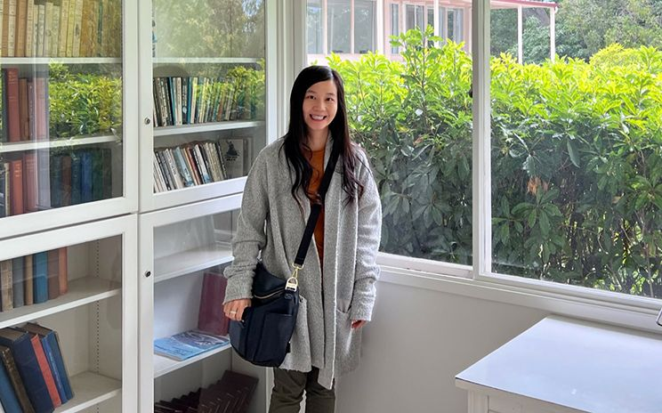

# Week 7 - Our role as facilitators

Date|Type|Description|Slides|Recording|
|---|----|-----------|------|---------|
|5/9|Putting the “us” in Design JUStice|Lecture|[Here](../materials/AA191_S_W7_Lecture_7.pdf)|[Here](https://tinyurl.com/4x77ew26)|
|5/11|[Conditionals, Map Layers, and Visual Design](../labs/week7/index.md)|Lab|Coming soon|Coming soon|

## Lecture

- [Putting the “us” in Design JUStice](../materials/AA191_S_W7_Lecture_7.pdf)

### Visiting Voice: Tiffany Guerra-Huang

{: style="max-width:500px"}

[Tiffany Guerra-Huang](https://tiffanyguerrahuang.com/) is a senior designer at Metro who collaborates on visual communications for the public. She’s passionate about information design to empower, connect, and inspire. She deeply cares about access to quality education and transit, and working towards racial, economic, and gender justice.

Email: [tiffanyguerrahuang@gmail.com](mailto:tiffanyguerrahuang@gmail.com)

## Lab

- [Conditionals, Map Layers, and Visual Design](../labs/week7/index.md)

## Assignments

### Due Wednesday 5/11

- [Lab Assignment #5](../assignments/week6/lab_assignment.md)
- [Survey Diagram and Wireframe](../assignments/week6/group_assignment.md)
  - [Submit using this Google form](https://forms.gle/8TU2Hj8o6J7UYjZ7A)!!
- [When2Meet Tech Tips **optional**](https://www.when2meet.com/?15574964-GBXOq)

### Due Monday 5/16

- [**Design Justice**](../assignments/week7/reading.md)
- [Thinking Cap #5](../assignments/week7/thinking_cap.md)
- Memo Revision #3 (email to submit)
- [Survey Revision](../assignments/week4/group_assignment.md)
### Due Wednesday 5/18

- [Lab Assignment #6](../assignments/week7/lab_assignment.md)
- Survey Diagram and Wireframe Revision

#### Readings:
1. [Dencik, L., Redden, J., and Treré, E. (2019) Exploring Data Justice: Conceptions, Applications and Directions](../materials/readings/DataJustice.pdf)