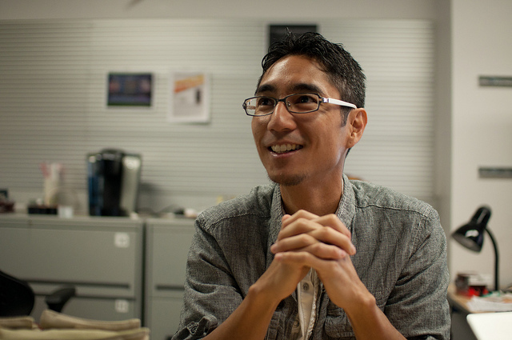

# Week 6 - Human-Centered Design

Date|Type|Description|Slides|Recording|
|---|----|-----------|------|---------|
|5/2|Design DeciCSSions|Lab|Coming soon|Coming soon|
|5/4|Designing for Civil Society|Lecture|Coming soon|Coming soon|

## Lab

- [Design DeciCSSions](../labs/week6/index.md)

## Lecture

- Designing for Civil Society
<!-- - [Designing for Civil Society](../materials/AA191_S_W5_Lecture_5.pdf) -->

<!-- ## Group Exercise

Instructions here:

- [https://tinyurl.com/aa191-54ex](https://tinyurl.com/aa191-54ex) -->

### Visiting Voice: Yoh Kawano

{: style="max-width:500px"}

[Tiffany Guerra-Huang](https://tiffanyguerrahuang.com/) is a designer at Metro who collaborates on visual communications for the public. She’s passionate about information design to empower, connect, and inspire. She deeply cares about access to quality education and transit, and working towards racial, economic, and gender justice.

Email: [tiffanyguerrahuang@gmail.com](mailto:tiffanyguerrahuang@gmail.com)

## Assignments

### Due Wednesday 5/4

- [Lab #4](../assignments/week4/group_assignment.md)
- [Survey Revision](../assignments/week4/group_assignment.md)
  - [Submit using this Google form](https://forms.gle/8TU2Hj8o6J7UYjZ7A)!!

### Due Thursday 5/5

- [Tiffany's Visiting Voice Survey](https://docs.google.com/forms/d/e/1FAIpQLSewtp-AVsaftbC2Ie5ZR5K03XSJXib-2SgpmQwYPDB4eaIGyw/) *Optional*

### Due Friday 5/6

- [Memo Revision #3](../assignments/week2/group_assignment.md)

### Due Monday 5/9

- [**Design Justice**](../assignments/week5/reading.md)
- [Thinking Cap #5](../assignments/week6/thinking_cap.md)

### Due Wendesday 5/11

- [Lab Assignment #5](../assignments/week6/lab_assignment.md)

Visiting voice

